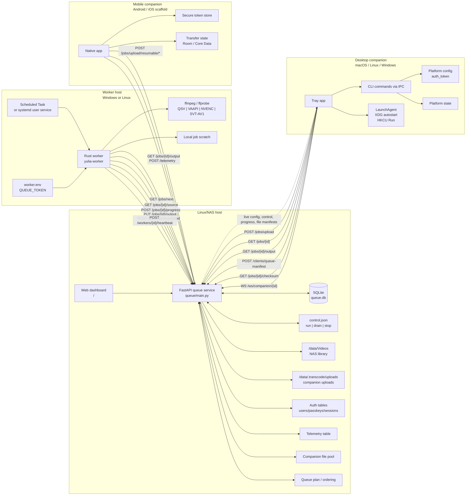

---
tags:
  - architecture
  - moc
---

# Architecture Map

## Maps

- [[01-Architecture/System Overview|System Overview]]
- [[01-Architecture/Component Map|Component Map]]
- [[01-Architecture/Data Model|Data Model]]
- [[01-Architecture/API Surface|API Surface]]
- [[02-Flows/NAS Scan Flow|NAS Scan Flow]]
- [[02-Flows/Worker Transcode Flow|Worker Transcode Flow]]
- [[02-Flows/Companion Upload Flow|Companion Upload Flow]]
- [[02-Flows/Verification and Safety Flow|Verification and Safety Flow]]

## Main Drift From Older Notes

The `AGENTS.md` and `CLAUDE.md` sketches describe a Python worker that mounts an SMB share and copies files directly. Current code uses a Rust worker that streams source and output through the queue API. Audio is re-encoded to AAC in the worker, not copied.

The worker is no longer Windows/QSV-only in code: Windows remains the deployment target with real host access, but the same binary now has Linux defaults, encoder probing for QSV/VAAPI/NVENC/SVT-AV1, `worker.env`, `diagnostics`, and `--version`.

The desktop companion is no longer macOS-only in code. macOS remains the first practical release target, but Linux and Windows adapters exist and need real-platform verification.
