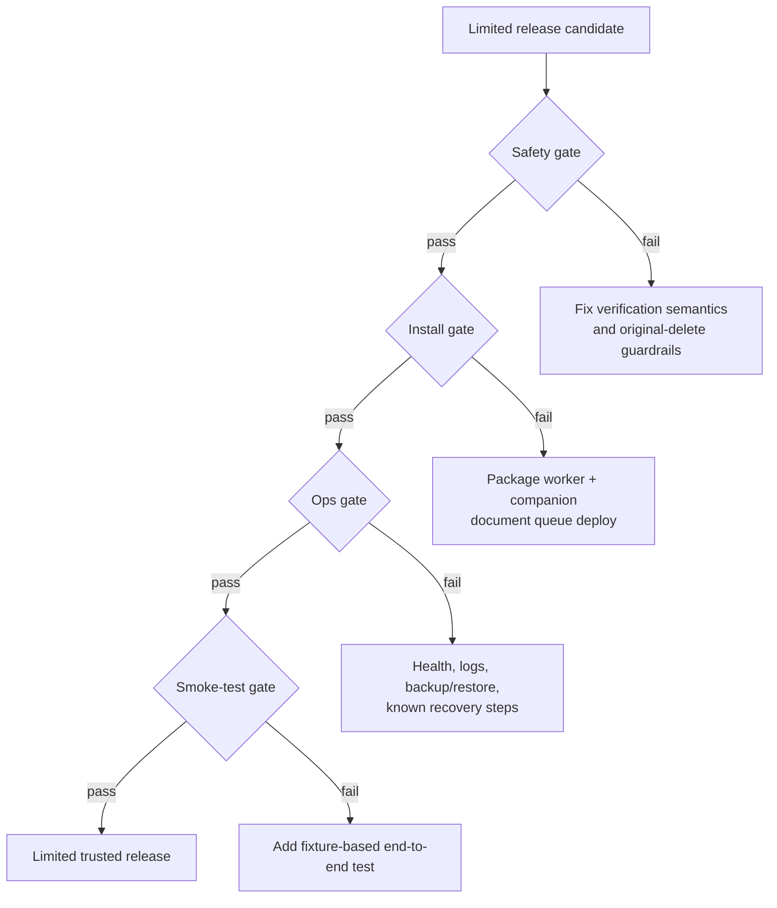
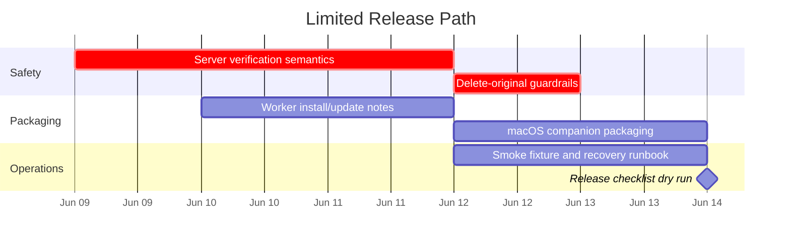

---
tags:
  - release
  - moc
---

# Release Map

The first release should be intentionally narrow: one Linux/NAS queue, one Windows worker, and one macOS companion for a trusted user.

## Release Notes

- [[05-Product/Limited Release Checklist|Limited Release Checklist]]
- [[03-Platforms/Platform Matrix|Platform Matrix]]
- [[04-Operations/Runbook|Runbook]]
- [[06-Risks/Open Questions|Open Questions]]

## Suggested Milestones

