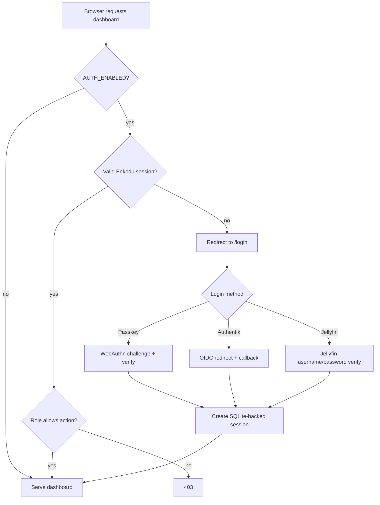
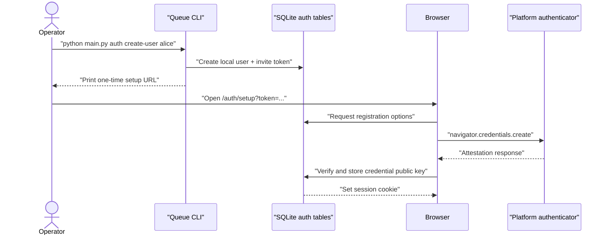

---
tags:
  - architecture
  - auth
  - security
---

# Authentication

The queue service now has an opt-in authentication layer for limited release. It is passwordless by design: local users authenticate with passkeys, and recovery or new-device enrollment happens only from the queue server command line.

## Goals

- Keep the dashboard closed when the queue is reachable beyond a private LAN.
- Encourage passkeys instead of passwords.
- Preserve a local recovery path that does not depend on an IdP outage.
- Allow Authentik or Jellyfin to become the source of identity when configured.
- Avoid breaking current workers and companions until their token wiring is rolled out.

## Auth Modes

| Mode | Status | Notes |
|---|---|---|
| Auth disabled | Default | Current trusted-LAN behavior. |
| Local passkey auth | Present | `AUTH_ENABLED=true`, users created/recovered from CLI. |
| Authentik OIDC | Present | Optional source via Authlib/OIDC discovery. |
| Jellyfin password auth | Present | Optional source via Jellyfin `AuthenticateByName`; Enkodu does not store Jellyfin passwords or tokens. |
| Worker token auth | Present | Worker sends `Authorization: Bearer ...` from `QUEUE_TOKEN` or `AUTH_WORKER_TOKEN`. |
| Companion token auth | Present | Companion sends `Authorization: Bearer ...` from `auth_token` or `ENKODU_AUTH_TOKEN`. |

## Runtime Flow



## Local Passkey Enrollment



## Roles

| Role | Intended access |
|---|---|
| `viewer` | Read-only dashboard and reports. |
| `operator` | Queue operations such as scan, requeue, force encode, rescan, and control commands. |
| `admin` | Settings, client weights, clear queues, and delete-original actions. |

## Configuration

Minimum local auth:

```env
AUTH_ENABLED=true
AUTH_PUBLIC_ORIGIN=https://enkodu.example.com
AUTH_SESSION_SECRET=<long random value>
```

Strict machine tokens:

```env
AUTH_WORKER_TOKEN=<long random value>
AUTH_COMPANION_TOKEN=<long random value>
AUTH_LEGACY_MACHINE_ACCESS=false
```

Worker configuration:

```env
QUEUE_TOKEN=<same value as AUTH_WORKER_TOKEN>
```

Companion configuration:

```toml
auth_token = "<same value as AUTH_COMPANION_TOKEN>"
```

The companion also accepts `ENKODU_AUTH_TOKEN` as an environment override for packaged or scripted installs.

Authentik:

```env
AUTHENTIK_ENABLED=true
AUTHENTIK_DISCOVERY_URL=https://auth.example.com/application/o/enkodu/.well-known/openid-configuration
AUTHENTIK_CLIENT_ID=<client id>
AUTHENTIK_CLIENT_SECRET=<client secret>
AUTHENTIK_ALLOWED_EMAIL_DOMAIN=example.com
AUTHENTIK_AUTO_CREATE_USERS=false
```

Jellyfin:

```env
JELLYFIN_ENABLED=true
JELLYFIN_URL=https://jellyfin.example.com
JELLYFIN_ALLOWED_USERS=alice,bob
JELLYFIN_AUTO_CREATE_USERS=false
JELLYFIN_AUTO_LINK_LOCAL_USERS=true
JELLYFIN_DEFAULT_ROLE=operator
```

Jellyfin login verifies credentials through `POST /Users/AuthenticateByName`, checks optional allow-list or administrator requirements, then immediately reports `/Sessions/Logout` with the returned Jellyfin token. Enkodu stores only the linked external subject and its own session cookie.

With `JELLYFIN_AUTO_LINK_LOCAL_USERS=true`, a pre-provisioned local user whose username matches the Jellyfin username is linked on first successful Jellyfin login. This keeps CLI provisioning useful without storing a Jellyfin password. Set `JELLYFIN_AUTO_CREATE_USERS=true` only if first-login account creation is acceptable for the deployment.

## CLI Recovery

All local recovery is command-line only:

```bash
python main.py auth create-user alice --display-name Alice --email alice@example.com --role admin
python main.py auth invite alice
python main.py auth reset-passkeys alice
python main.py auth revoke-sessions alice
python main.py auth disable-user alice
python main.py auth list-users
```

## Remaining Work

- Decide whether the companion should use a user session, a device token, or both for future multi-user releases.
- Add tests around passkey option generation, middleware role checks, Authentik callback provisioning, Jellyfin provisioning, and strict token mode.
