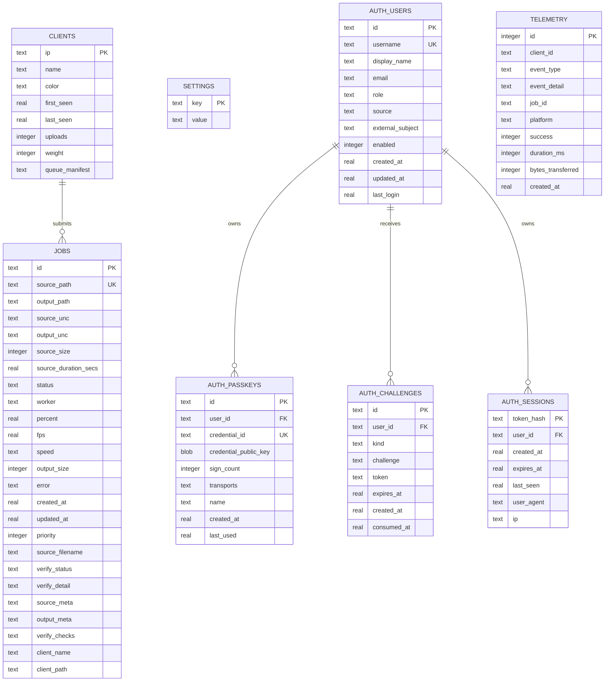

---
tags:
  - architecture
  - data
---

# Data Model

The queue service uses SQLite at `DB_PATH` with WAL enabled. The default path is under `/data/.transcode/queue.db`; concrete deployment paths belong in the external secrets file.

## Job Statuses

| Status | Meaning |
|---|---|
| `pending` | Waiting to be claimed by a worker |
| `active` | Claimed by a worker |
| `done` | Worker reported output uploaded; server verification may still be running |
| `failed` | Worker or operator marked failure |

## Verification Statuses

| Status | Meaning |
|---|---|
| `running` | Server-side verification thread is probing output |
| `pass` | Server-side checks passed |
| `fail` | Server-side checks failed |
| null | Not verified, old job, or not yet started |

## In-Memory State

The service also keeps:

- `_live`: live job progress, lost on process restart.
- `_workers`: worker heartbeat/status registry, lost on process restart.
- `_control`: run/drain/stop command, persisted to `control.json`.
- `_resumable_uploads`: active upload sessions, lost on process restart. Session metadata and partial bytes are also written under `/data/.transcode/uploads/resumable_<upload_id>/`, but the in-memory map is authoritative until resumable sessions are made durable.
- `_sha256_cache`: process-local cache keyed by output path and mtime.

## Client State

Desktop companion state is keyed by local file path. It prevents duplicate submissions and supports interrupted download recovery.

Platform defaults:

| Client | Config | State |
|---|---|---|
| macOS desktop | `~/.config/enkodu/config.toml` | `~/.config/enkodu/state.json` |
| Linux desktop | `$XDG_CONFIG_HOME/enkodu/config.toml` or `~/.config/enkodu/config.toml` | `$XDG_STATE_HOME/enkodu/state.json` when set, otherwise config dir |
| Windows desktop | `%APPDATA%\Enkodu\config.toml` | `%LOCALAPPDATA%\Enkodu\state.json` |
| Android | EncryptedSharedPreferences / Room | Room transfer database |
| iOS | UserDefaults + Keychain | Core Data transfer state |
