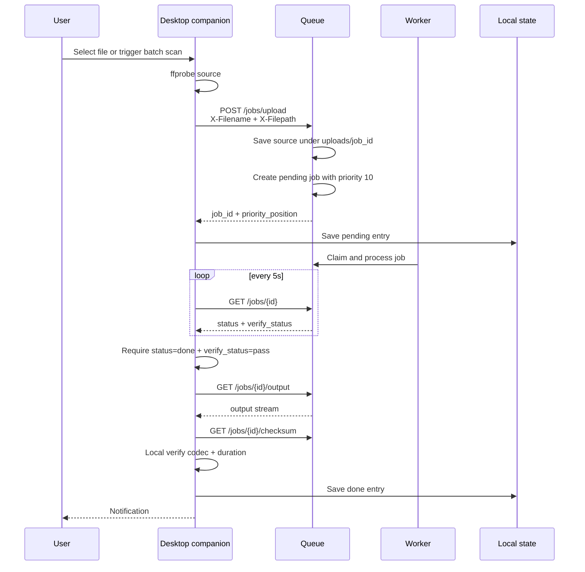
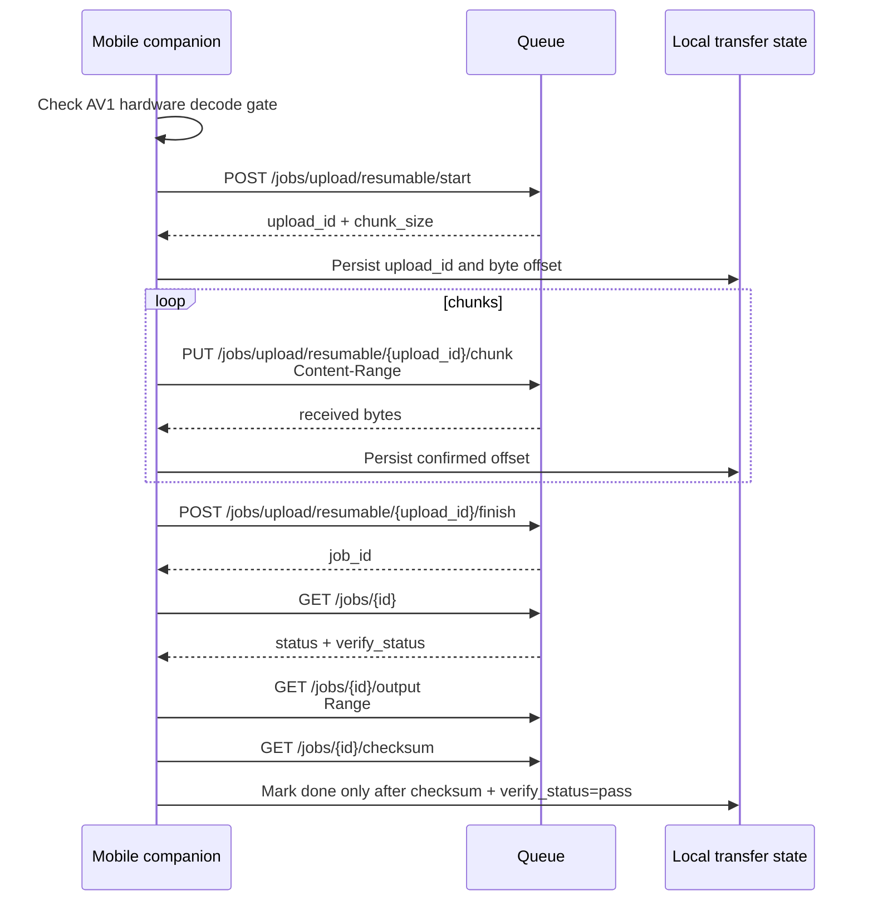

---
tags:
  - flow
  - companion
---

# Companion Upload Flow

At startup the desktop companion registers its stable ID and capabilities, fetches any pending remote configuration, and opens `WS /ws/companion/{id}`. The connection carries live control/configuration and progress messages. Local scanning periodically publishes a file manifest to the queue's file pool; operators can inspect, exclude, reorder, and build that pool into jobs through the queue-plan API.

## Mobile / Resumable Variant

## Modes Present In Code

- Tray submit through file picker.
- Batch scan over configured directories.
- IPC commands to trigger `scan`, `reconcile`, `status`, NAS pause/resume, Mac pause/resume.
- Recovery of unfinished downloads on startup.
- Reconcile mode that matches server-done jobs back to local files by filename plus metadata.
- `wanryo` helper that emits a CSV checklist for manual review/deletion decisions.
- Bearer-token support through `auth_token` or `ENKODU_AUTH_TOKEN`.
- Connection/auth diagnostics through `enkodu test`.
- Retry/backoff and checksum verification for transfer paths.

## Companion Config

Default path: `~/.config/enkodu/config.toml`

Important fields:

- `server_url`
- `scan.directories`
- `scan.extensions`
- `behavior.mode`
- `behavior.on_success`
- `behavior.backup_suffix`
- `behavior.skip_if_av1`
- `behavior.min_duration_secs`

## Release Gaps

- macOS binary is downloaded unsigned and requires quarantine removal.
- No versioning or update channel.
- No notarized `.app`, `.pkg`, Homebrew tap, or Sparkle-style updater.
- `replace` mode exists and should stay off by default for limited release.
- Linux and Windows companions have platform adapters, but need real-platform tray, notification, IPC, submit/download, and reconcile verification.
- Mobile clients are scaffolded, but need real-device auth, background transfer, and save/share verification.
