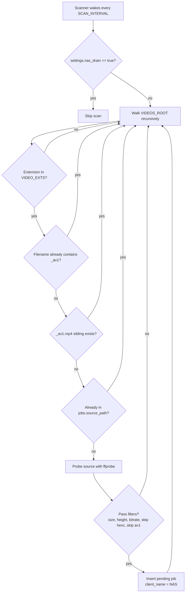

---
tags:
  - flow
  - nas
---

# NAS Scan Flow

## Eligibility Rules

Scanner currently skips:

- Non-video extensions.
- Files whose stem contains `_av1`.
- Files with an existing `_av1.mp4` sibling.
- Files already present in `jobs.source_path`.
- AV1 and HEVC when the corresponding settings are enabled.
- Files below configured minimum size, height, or bitrate.

## Dispatch Rule

`/jobs/next` selects a client using weighted fair queueing, then picks the highest priority and largest source file within that client. Companion uploads default to priority `10`; NAS jobs default lower.

## Release Notes

- The scanner mutates only SQLite, not source files.
- The `source_path` uniqueness constraint prevents duplicate NAS jobs.
- There is no durable scan history beyond jobs and logs.
- If `ffprobe` is absent or broken in the queue container, scanning and verification quality decline.

