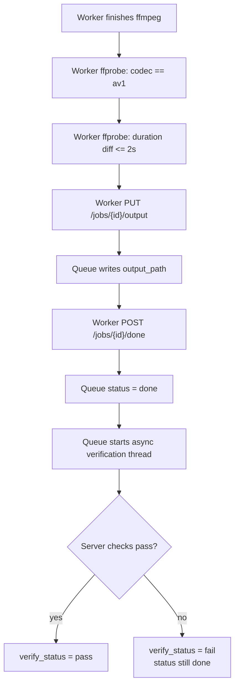
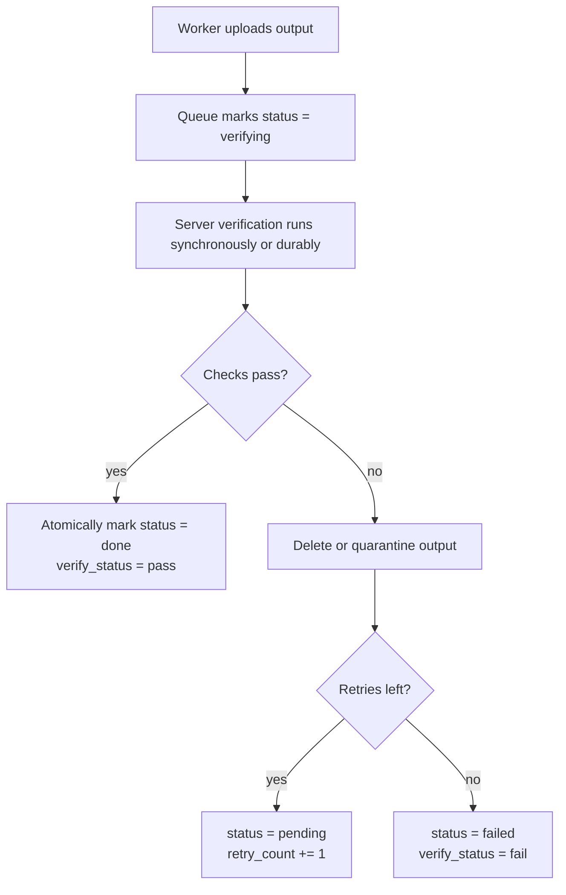

---
tags:
  - flow
  - safety
  - release-blocker
---

# Verification and Safety Flow

## Current Implementation

## Target Release Semantics

## Checks Present

Worker local checks:

- Output file exists.
- Video codec is `av1`.
- Duration differs from source by at most 2 seconds.

Server checks:

- Video codec is `av1`.
- Duration differs by at most 2 seconds.
- Audio codec is AAC or absent.
- Resolution matches source when source dimensions are known.
- Frame count is informational/non-fatal due container unreliability.

Companion local download checks:

- Codec is `av1`.
- Duration differs from original by at most 2 seconds for direct uploads.
- Recovery path may do codec-only check because server already verified.

## Safety Rules For Limited Release

- Do not delete or rename originals unless `verify_status=pass`.
- Do not call a job complete in UI unless `status=done` and `verify_status=pass`.
- Treat `verify_status=fail` as a failure even if `status=done`.
- Keep manual review (`wanryo` CSV) for source deletion.
- Preserve `_av1` sibling naming by default.

## Guardrails Present In Code

- `GET /jobs/{id}/output` calls the verified-output gate and returns `404` until `status=done` and `verify_status=pass`.
- `GET /jobs/{id}/checksum` refuses output checksums when output is not verified pass.
- `POST /jobs/{id}/delete-original` and `POST /jobs/bulk-delete-original` require verified pass before deleting or renaming.
- `queue/test_safety.py` covers output download, checksum, delete-original, bulk delete, and telemetry guardrails.

## Remaining Release Blockers

- Align database statuses with verification truth.
- Add retry/dead-letter fields or an equivalent failure policy.
- Decide whether failed output files are deleted, quarantined, or retained for investigation.
- Keep the dashboard and clients visually strict: `done` alone must not look safe.
