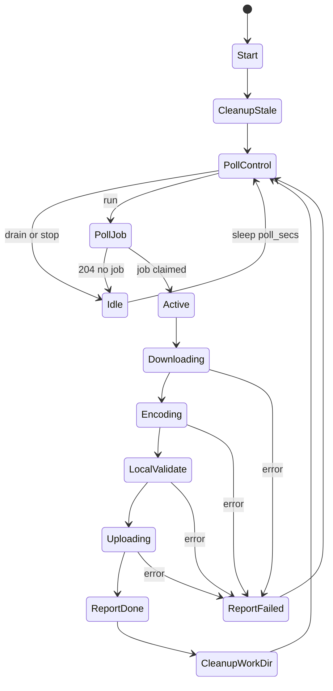
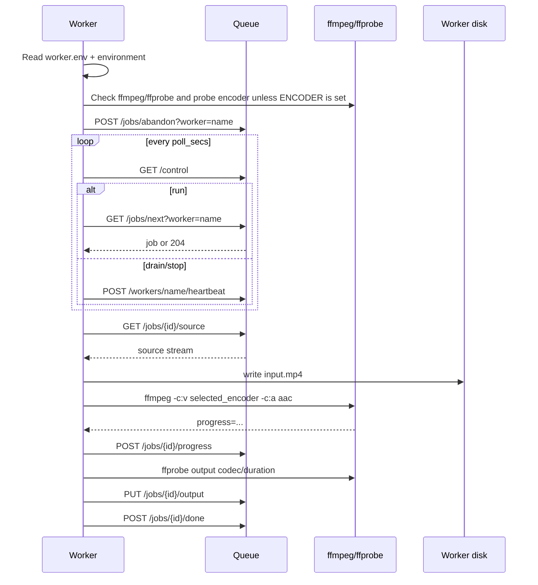

---
tags:
  - flow
  - worker
---

# Worker Transcode Flow



## Sequence



## Encoder Selection

If `ENCODER` is set, the worker uses it directly. If it is empty, the worker probes encoders with a one-second null encode and picks the first successful candidate:

1. `av1_qsv`
2. `av1_vaapi`
3. `av1_nvenc`
4. `libsvtav1`

Quality flag by encoder:

| Encoder | Quality flag | Preset behavior |
|---|---|---|
| `av1_qsv` | `-global_quality` | Uses `ENCODE_PRESET` or `medium` |
| `av1_vaapi` | `-qp` | Uses `VAAPI_DEVICE`; no preset argument |
| `av1_nvenc` | `-cq` | Uses `ENCODE_PRESET` or `p4` |
| `libsvtav1` | `-crf` | Uses `ENCODE_PRESET` or `6` |

## Example Command

Example QSV command:

```text
ffmpeg -i input.mp4 -c:v av1_qsv -global_quality 28 -preset medium -c:a aac -b:a 192k -movflags +faststart -progress pipe:1 -stats_period 2 -loglevel error output_av1.mp4 -y
```

## Worker Release Gaps

- Real Windows fixture transcode run still needs to be captured.
- Real Linux host diagnostics and fixture run still need to be captured.
- ffmpeg/ffprobe dependency bootstrap is documented but not automated.
- No macOS worker target.
- Stop command kills ffmpeg, but job cleanup depends on subsequent error handling and stale cleanup.
- Local validation only checks codec and duration.
- Server marks `status=done` before async server verification completes, so clients must require `verify_status=pass`.

## Diagnostics and Auth

`yulia-worker --version` prints the Cargo package version.

`yulia-worker diagnostics` checks:

- ffmpeg and ffprobe reachability.
- selected/detected encoder can encode a one-second test clip.
- queue health via `/healthz` or `/status`.
- bearer token acceptance when `QUEUE_TOKEN` or `AUTH_WORKER_TOKEN` is configured.

If a worker receives `401` or `403` from critical queue endpoints, it logs an actionable auth error, sleeps for 30 seconds, and exits with code `2` so the operator can fix `worker.env` and restart.
