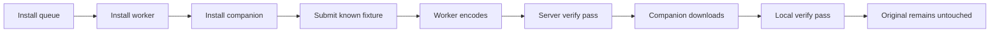

---
tags:
  - release
  - checklist
---

# Limited Release Checklist

## Proposed Release Shape

Release to one or two trusted users on private networking:

- `+` Linux/NAS queue service.
- `~` Windows worker.
- `~` macOS companion.
- `~` Linux companion.
- `~` Linux worker.
- `~` Windows companion.
- `~` Android companion.
- `~` iOS companion.

Only the queue, Windows worker, and macOS companion are in the narrow release shape. Other `~` platforms have code scaffolding, not release evidence.

## P0 Blockers

- [ ] Make completion semantics safe: `done` should require `verify_status=pass`, or UI/actions must treat non-pass as incomplete.
- [x] Require verified-good output before delete-original endpoints can run.
- [x] Require verified-good output before output download and checksum endpoints expose output bytes/checksums.
- [ ] Decide and implement failed-output policy: delete, quarantine, or retain with warning.
- [x] Add safety tests for verified-output gates and telemetry guardrails.
- [x] Add resumable and full-flow test scripts.
- [ ] Run one tiny end-to-end smoke fixture with a real worker: upload or scan -> worker encode -> server verify -> download -> local verify.
- [ ] Document exact deploy/update/restart steps for queue, Windows worker, and macOS companion.
- [x] Add opt-in queue authentication: local passkeys, CLI-only recovery, optional Authentik OIDC, and optional Jellyfin login.
- [x] Wire worker and companion clients to send configured bearer tokens.
- [ ] Run a deployment dry-run with `AUTH_LEGACY_MACHINE_ACCESS=false`.
- [x] Add a version string to worker binary and expose it in logs/diagnostics.
- [ ] Add `enkodu --version` / `enkodu -V` for the desktop companion.

## P1 Strongly Recommended

- [x] Worker config file instead of env-only/default-path setup.
- [x] Worker diagnostics command that checks queue, ffmpeg, ffprobe, encoder availability, and auth token acceptance when configured.
- [ ] macOS companion first-run dependency check for `ffprobe`.
- [ ] Versioned companion download endpoint.
- [x] Basic backup/restore docs for SQLite and control state.
- [ ] Add auth smoke tests: passkey option generation, role checks, Authentik provisioning, Jellyfin provisioning, and strict machine-token mode.
- [ ] Dashboard warning when `status=done` but `verify_status` is not `pass`.
- [ ] Retry count/dead-letter policy for repeated failures.
- [ ] Avoid embedding the dashboard as one massive Python string before serious UI work.

## P2 After First Trusted Release

- [ ] Linux companion real-desktop verification.
- [ ] Windows companion real-host verification.
- [ ] Linux worker real-host encoder fixture runs.
- [ ] Better perceptual verification or sample-based quality checks.
- [ ] Signed/notarized macOS distribution.
- [ ] Installer/update flow for worker.
- [ ] Mobile companion real-device auth, transfer, and save/share verification.

## Release Acceptance Test

## Go / No-Go

Go if:

- A fresh install can complete the acceptance test.
- A failed encode leaves the original untouched and clearly marks the job failed.
- Restarting the worker during an active job requeues or finishes predictably.
- The release operator knows how to roll back queue and worker.

No-go if:

- Any destructive operation can run on unverified output.
- Users can mistake unverified `done` for safe-to-delete.
- The worker cannot recover after a killed ffmpeg process.
- Queue API is exposed beyond the intended trusted network without protection.
