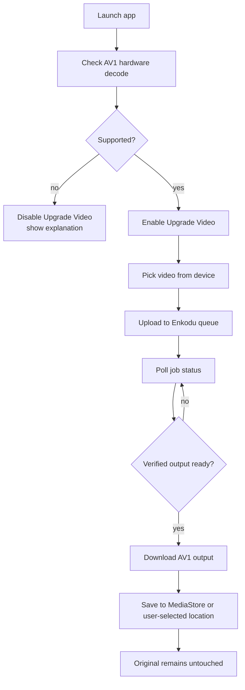
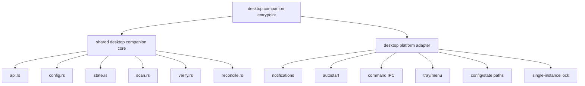
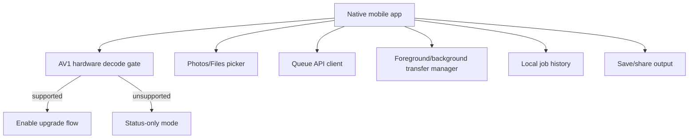
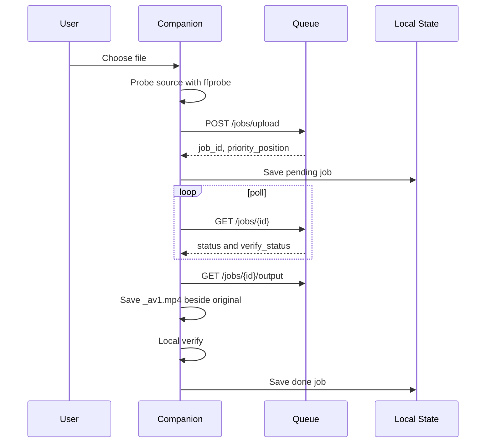
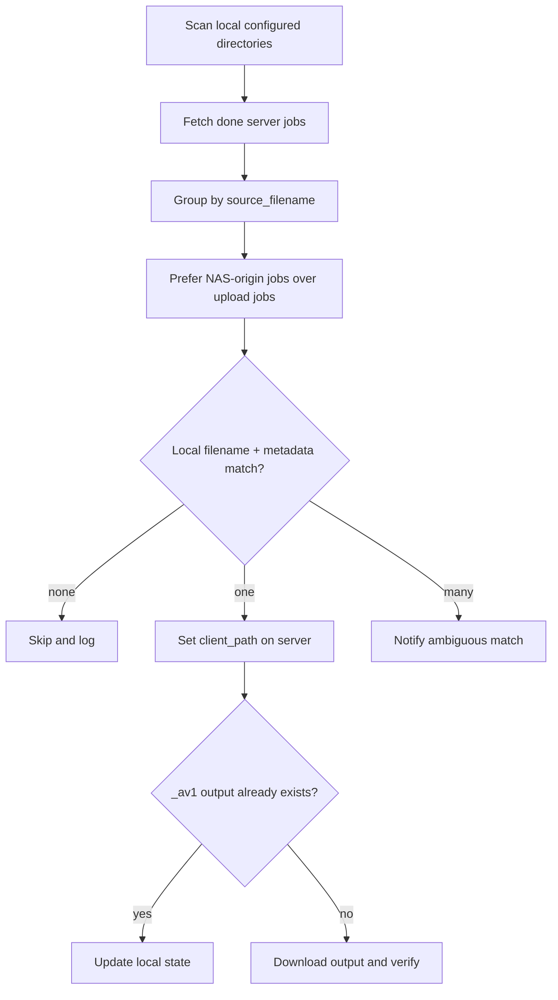
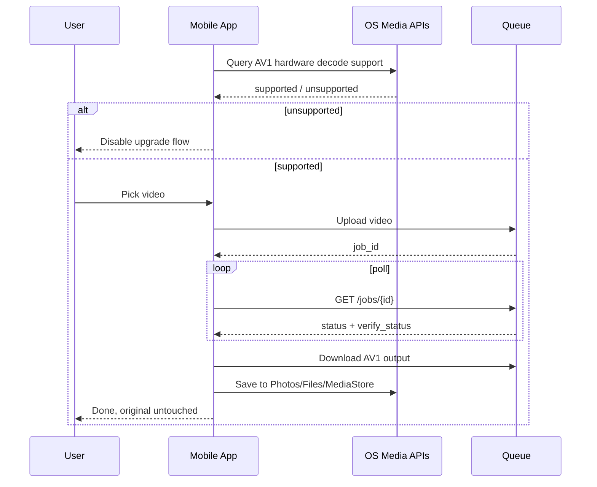
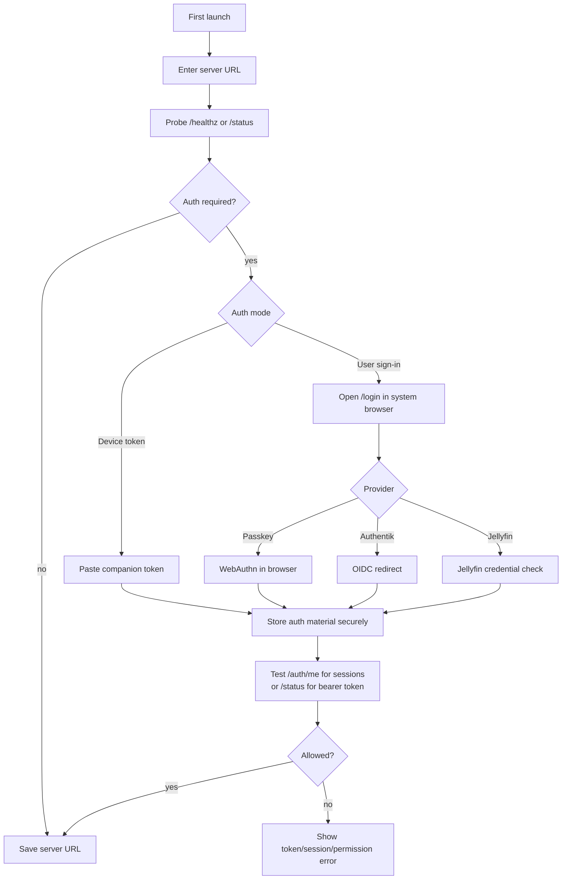

---
tags:
  - prd
  - clients
  - companion
  - mobile
  - android
  - ios
  - vibe-cli
  - release
created: 2026-06-09
last_updated: 2026-06-10
last_audited: 2026-06-10
gap_audit: 2026-06-10
---

# PRD: Missing Companion Clients

## Agent Handoff Summary

Build Enkodu companion clients across desktop and mobile.

Current status after 2026-06-10 work:

- Desktop shared-core refactor: done. `retry.rs` module with exponential backoff, 4 passing unit tests.
- Desktop retry wired into `api.rs`, `submit.rs`, `reconcile.rs`, `wanryo.rs`.
- Desktop checksum verification wired into `submit.rs` and `recover_one()`.
- Linux companion: code/docs/build script present, needs real Linux verification.
- Windows companion: code/docs/build script present; loopback IPC bridge and HKCU Run autostart are implemented, but need real Windows runtime verification.
- Android companion: scaffolded with device-token auth/storage now wired and Gradle unit tests passing, but not release-ready. Remaining gaps include real-device AV1 gate, MediaStore save, transfer edge cases, and release evidence.
- iOS companion: scaffolded with Keychain-backed device-token storage and API auth injection now wired, but not release-ready. Remaining gaps include full Xcode build, background resumable protocol compliance, save/share UX, and release evidence.
- Server-side resumable upload protocol implemented with chunked uploads.
- Server-side HTTP Range support for download resume.
- Server-side SHA-256 checksum endpoint.
- Server-side telemetry endpoint.
- Server-side output/checksum/delete-original safety now requires verified-pass output.
- Server-side telemetry now has basic guardrails for length, negative metrics, obvious secrets, and path-heavy details.
- Server-side 24h resumable upload cleanup.
- Server-side health check and version endpoints.
- Queue authentication is now opt-in but present: local passkeys, optional Authentik, optional Jellyfin, and worker/companion bearer tokens.
- Desktop companion API calls can send `Authorization: Bearer ...` from TOML `auth_token` or `ENKODU_AUTH_TOKEN`.
- Strict machine-token enforcement only applies when `AUTH_ENABLED=true`, the relevant token is configured, and `AUTH_LEGACY_MACHINE_ACCESS=false`.

Important boundary:

- This PRD is for companion clients.
- It is not for Linux/macOS/Android/iOS worker implementations.
- Mobile apps submit videos to the Enkodu queue for server/worker processing; they do not transcode on-device.

Mobile hard gate:

- Android and iOS must check for AV1 hardware decode support before enabling any "upgrade this video" flow.
- If AV1 hardware decode is unavailable, the app may show status/monitoring, but must not allow AV1 conversion/download-to-device as a user action.

## Progress Report: 2026-06-10 Audit

Vibe-cli committed three companion phases on `main`:

| Commit | Result |
|---|---|
| `6cb495f` | Phase 1: extracted `companion/src/core/*` and `companion/src/platform/*` |
| `c772069` | Phase 2: added Linux platform adapter, docs, build script |
| `bd7a9d0` | Phase 3: added Windows platform adapter, docs, build script |

Additional work completed on 2026-06-10:

- Server-side resumable upload protocol (`/jobs/upload/resumable/start`, `chunk`, `finish`).
- Server-side HTTP Range support on `GET /jobs/{id}/output`.
- Server-side SHA-256 checksum endpoint (`/jobs/{id}/checksum`).
- Server-side telemetry endpoint (`/telemetry`, `/telemetry/summary`).
- Server-side 24h resumable upload cleanup.
- Server-side health check (`/healthz`) and version (`/version`).
- Desktop retry module (`companion/src/retry.rs`) with 4 passing unit tests.
- Desktop retry wired into `api.rs`, `submit.rs`, `reconcile.rs`, `wanryo.rs`.
- Desktop checksum verification wired into `submit.rs` and `recover_one()`.
- Android project scaffolded with broad components (AV1 gate, transfer manager, UI, telemetry, error handling, onboarding), but auth and release-critical wiring remain.
- iOS project scaffolded with broad components (AV1 gate, transfer manager, background tasks, notifications, telemetry, error handling, onboarding), but auth and release-critical wiring remain.
- Mobile Transfer Manager Design document (`docs/obsidian-vault/05-Product/Mobile Transfer Manager Design.md`).
- E2E test script (`queue/test_e2e.py`).
- Integration test scripts (`queue/test_resumable.py`).
- Android integration tests (`mobile/android/app/src/androidTest/java/com/enkodu/companion/IntegrationTest.kt`).
- iOS UI tests (`mobile/ios/Enkodu/EnkoduTests/EnkoduTests.swift`).
- Queue auth layer: local passkeys, CLI-only recovery, optional Authentik OIDC, optional Jellyfin login.
- Strict machine-token support: `AUTH_WORKER_TOKEN`, `AUTH_COMPANION_TOKEN`, and `AUTH_LEGACY_MACHINE_ACCESS=false`.
- Desktop companion bearer-token support from TOML `auth_token` or `ENKODU_AUTH_TOKEN`.
- Desktop `enkodu test` now validates bearer tokens against protected `/status` instead of `/auth/me`.
- Worker bearer-token support from `QUEUE_TOKEN` or `AUTH_WORKER_TOKEN`.
- Windows companion loopback IPC bridge implemented via `127.0.0.1` metadata under `%LOCALAPPDATA%\Enkodu\ipc.json`.
- Windows companion autostart implemented through `HKCU\Software\Microsoft\Windows\CurrentVersion\Run`.
- Android device-token auth package added: secure storage, runtime bearer injection, `/status` probe, onboarding/settings UI, and auth unit tests.
- iOS device-token auth added: Keychain storage, runtime bearer injection, `/status` probe, onboarding/settings UI, and auth unit tests.

Validation performed:

| Check | Result | Notes |
|---|---|---|
| `cargo check` in `companion/` on macOS host | Pass | Warnings only (pre-existing unused imports, deprecated winit APIs) |
| `cargo check --target x86_64-pc-windows-gnu` | Pass | Warnings only |
| `cargo check --target x86_64-pc-windows-msvc` | Pass | Warnings only |
| `cargo test` in `companion/` | Pass | 34 tests |
| `cargo check --target x86_64-unknown-linux-gnu` from macOS | Fail | OpenSSL/sysroot cross-compilation issue, not proof Linux code is broken |
| `queue/test_e2e.py` | Pass | Full upload→poll→verify→download→checksum flow |
| `queue/test_resumable.py` | Pass | Resumable upload/download integration |
| `queue/test_safety.py` | Pass | 6 tests for verified-pass output/checksum/delete-original and telemetry guardrails |
| Auth syntax check | Pass | `python3 -m py_compile queue/main.py` |
| Mocked Jellyfin login probe | Pass | Login route, auto-provisioning, session cookie, and empty-password block |
| Android `gradle --no-daemon test` | Pass | Requires `JAVA_HOME`/Gradle Java 17 and in-process Kotlin compiler strategy |
| iOS touched Swift parse | Pass | `swiftc -parse` against iOS simulator SDK; full Xcode project build not run because `xcodegen` is unavailable |

Auth gaps still relevant to this PRD:

- Desktop `enkodu test` CLI now validates companion bearer-token mode through `/status`, but the tray UI still needs a friendly way to configure/test auth without manually editing TOML.
- Mobile clients now have first-pass device-token auth storage/probing on Android and iOS. Browser/session callbacks and full re-auth flows are still pending.
- End-to-end deployment testing with `AUTH_LEGACY_MACHINE_ACCESS=false` is still pending.
- Jellyfin has been added as a source for Enkodu user sessions, but no live Jellyfin deployment test has been run yet.

## What Is Done

## Desktop Core

Done:

- A platform abstraction exists in `companion/src/platform/mod.rs`.
- Submit, batch, poll, and command logic were moved toward `companion/src/core/*`.
- `retry.rs` module with `RetryConfig`, `RetryState`, `should_retry()`, and `retry_with_backoff()`.
- `api.rs` functions now require `auth_token: Option<&str>`; all call sites updated.
- `submit.rs` wired with retry logic and checksum verification (`download_with_checksum`, `verify_checksum`).
- `reconcile.rs` wired with retry logic (`download_with_checksum`, `retry_with_backoff`).
- `wanryo.rs` wired with retry logic (`retry_with_backoff` for link, submit, poll).
- macOS still typechecks.
- Windows targets typecheck.
- Linux adapter exists.

Not fully done:

- Some duplicated command dispatch remains in `companion/src/ipc.rs` and `companion/src/core/commands.rs`.
- `mac_drain` field name still in `ServerState` (internal only; user-facing text is now "Local").

## Linux Companion

Done:

- Linux platform adapter exists.
- Linux notification path uses `notify-send`.
- Linux autostart writes an XDG desktop entry.
- Linux docs and build script exist.
- Desktop retry logic now applies to Linux targets.

Not fully done:

- Needs a real Linux desktop build/run.
- Needs tray validation under at least one common desktop environment.
- Needs upload/download/reconcile fixture verification.
- Needs confirmation that docs match actual config/state paths after path fix.

## Windows Companion

Done:

- Windows adapter exists.
- Windows targets typecheck.
- Windows docs and build script exist.
- Windows config/state paths are implemented as `%APPDATA%\Enkodu\config.toml` and `%LOCALAPPDATA%\Enkodu\state.json`.
- Windows build script artifact path has been fixed.
- Desktop retry logic now applies to Windows targets.
- Windows command bridge implemented as a local loopback IPC server. The tray binds `127.0.0.1` on an ephemeral port and writes `%LOCALAPPDATA%\Enkodu\ipc.json` with port, PID, and random auth token.
- Windows CLI commands now dispatch through shared `core::commands` via the loopback bridge.
- Windows autostart writes/removes an `HKCU\Software\Microsoft\Windows\CurrentVersion\Run` entry and cleans up the old placeholder flag file.

Not fully done:

- Needs actual Windows runtime validation that `enkodu.exe status`, `scan`, `reconcile`, and pause/resume commands reach the running tray.
- Needs actual Windows runtime validation that HKCU Run autostart enables/disables cleanly.
- Notifications use a blocking PowerShell message box style, not proper toast notifications.
- Single-instance behavior is not defined for Windows or Linux: launching the tray twice should either focus the running instance, exit with a clear log line, or use a documented fallback.
- `enkodu --version` / `enkodu -V` is missing.
- Per-platform update and uninstall instructions are incomplete.

## Native Android Companion

Done:

- Android project scaffolded in `mobile/android/`.
- Kotlin + Jetpack Compose + Room + WorkManager + Retrofit.
- AV1 capability gate (`Av1CapabilityChecker.kt`) via `MediaCodecList.isHardwareAccelerated`.
- Resumable upload/download (`TransferManager.kt`) with SQLite state persistence.
- WorkManager integration (`UploadWorker`, `DownloadWorker`) with constraints.
- Foreground service (`TransferService.kt`) with progress notifications.
- Video picker (`VideoPicker.kt`) with cache copy.
- Settings screen with URL validation and health check ping.
- Error handling UI (`ErrorDialog`, `ErrorStateView`, `TransferErrorCard`).
- Telemetry manager (`TelemetryManager.kt`) with fire-and-forget tracking.
- Onboarding flow (`OnboardingScreen.kt`) with first-launch detection.
- Pull-to-refresh queue status (`QueueStatusScreen.kt`).
- Localization (`strings.xml` with 40+ strings).
- Integration tests (`IntegrationTest.kt`).
- Device-token auth package with `AuthStore`, `AuthRepository`, protected `/status` probe, bearer-token OkHttp interceptor, and auth state mapping.
- Auth material stored with `androidx.security:security-crypto` encrypted preferences, with a fallback preference store if encrypted preferences are unavailable.
- Onboarding/settings UI can enter, replace, clear, and test companion token.
- API and transfer clients resolve bearer token at runtime instead of putting token material into WorkManager input data.
- Android JVM auth tests added for config validation, header injection, and probe-result mapping.
- Android Gradle test passes after pinning Kotlin compiler execution to in-process Java 17.

Not fully done:

- Browser/session auth is not implemented end to end: no callback handling and no passkey/Authentik/Jellyfin native session handoff.
- Need to verify that every protected queue call fails closed before auth is configured.
- Needs actual device testing for hardware AV1 gate.
- AV1 gate is only partially enforced in UI; upload/download/save paths must also be blocked when hardware decode is unavailable.
- Background transfer policy is incomplete: implement 30s network-loss pause/resume and explicit <15% pause / >20% resume battery thresholds.
- Completed downloads currently need a user-visible MediaStore or approved picker destination with source filename + `_av1` naming semantics.
- 401/403 transfer state transitions must be explicit: 401 pauses as needs re-auth; 403 blocks as permission denied.
- Needs Enkodu logo vector for `ic_notification.xml`.
- Needs actual server integration test against strict auth.
- Needs release signing, artifact production, and Android release QA checklist.
- Needs tests for auth bootstrap, token header injection, callback handling, 401/403 recovery, resume after disconnect, and MediaStore save behavior.

## Native iOS Companion

Done:

- iOS project scaffolded in `mobile/ios/Enkodu/`.
- Swift + SwiftUI + Core Data + URLSession.
- AV1 capability gate (`Av1CapabilityChecker.swift`) via `VideoToolbox.VTIsHardwareDecodeSupported`.
- Resumable upload/download (`TransferManager.swift`) with Core Data persistence.
- Background session manager (`BackgroundSessionManager.swift`) with `URLSessionConfiguration.background`.
- Background task manager (`BackgroundTaskManager.swift`) with `BGProcessingTask`.
- Notification manager (`NotificationManager.swift`) with `UNUserNotificationCenter`.
- Settings view with connectivity test.
- Error handling UI (`ErrorAlert`, `ErrorStateView`, `TransferErrorCard`, `UserFacingError`).
- Telemetry manager (`TelemetryManager.swift`) with `OperationQueue`.
- Onboarding flow (`OnboardingView.swift`) with `AppStorage`.
- Pull-to-refresh queue status (`QueueStatusView.swift`).
- Localization (`Localizable.strings` with 40+ strings).
- UI tests (`EnkoduTests.swift`).
- Keychain-backed device-token storage (`KeychainStore`, `AuthStore`).
- API client can inject bearer token from Keychain-backed auth store on protected queue calls.
- Onboarding/settings UI can enter, clear, and test companion token against protected `/status`.
- Auth probe maps protected endpoint responses to connected, token rejected, permission denied, or server unreachable.
- iOS auth request tests added for bearer injection and auth-state mapping.

Not fully done:

- Browser/session auth is not implemented end to end: no callback handling, no `/auth/me` session check, and no passkey/Authentik/Jellyfin native session handoff.
- Full Xcode project build/test not verified because `xcodegen` is unavailable in this environment.
- Background upload currently uses URLSession file-level behavior that does not satisfy the server chunk protocol; resumable uploads must send explicit `Content-Range` chunks and recover from the last confirmed byte.
- 401/403 handling in background sessions must map to paused re-auth or permission-denied states instead of generic failure.
- Upload/download/save/share UI is incomplete for the full job lifecycle.
- Needs actual device testing for hardware AV1 gate.
- Needs Enkodu logo for AppIcon.
- Needs actual server integration test against strict auth.
- Needs App Store provisioning, signing, and a reproducible release build lane.
- Needs tests for auth bootstrap, Keychain storage, token/session injection, background resume, 401/403 recovery, and save/share behavior.

## Mobile Transfer Manager

Done:

- `Mobile Transfer Manager Design.md` document with full specification.
- 8 MiB chunk size for all platforms.
- Exponential backoff: 1.5x mobile, 2x desktop.
- Retry policy: 10 retries for network/server errors.
- WiFi-only defaults, battery-aware pause/resume.
- Transfer state persistence is designed and scaffolded (SQLite/Room on Android, Core Data on iOS), but still needs interruption/restart proof.
- Full design spec with state diagrams, code samples, and API contract.

Not fully done:

- Needs actual network drop/resume testing.
- Needs battery/thermal throttling testing.
- Needs disk-space failure testing.

## Remaining Desktop Work

## P0: Must Fix Before Calling Desktop Clients Done

- [x] Use platform config/state dirs everywhere.
  - `config.rs` uses `#[cfg]` blocks: macOS `~/.config/enkodu`, Linux XDG, Windows `%APPDATA%`.
  - `state.rs` uses `crate::platform::get_platform().state_dir()`.
- [x] Add desktop companion token plumbing and initial diagnostics.
  - Companion API requests can send bearer tokens from TOML or environment.
  - `enkodu test` CLI command runs the connection test.
  - `ENKODU_AUTH_TOKEN` env override already supported in `api::with_auth()`.
  - Auth token is never logged or displayed in settings.
- [x] Correct desktop companion auth diagnostics.
  - `api::test_connection()` treats `/healthz` as optional liveness and validates bearer-token mode through protected `/status`.
  - `/auth/me` is no longer used as companion bearer-token proof.
- [x] Implement real Windows command bridge.
  - Implemented as an authenticated local loopback bridge, not named pipes.
  - `enkodu.exe status`, `scan`, `reconcile`, `pause-nas`, `resume-nas`, `pause-local`, and `resume-local` must work.
- [x] Implement real Windows autostart.
  - Implemented through the HKCU Run key and cleanup of the legacy flag file.
- [x] Fix Windows build script artifact path.
  - `build-windows.ps1` now uses `target\$Target\$TargetDir\$BinName.exe` with fallback.
- [x] Restore user notifications for submit, batch, recovery, and reconcile outcomes.
  - `submit_bg` now sends notifications for probe failure, upload failure, job failure, checksum mismatch, verify failure, and success.
  - `batch_bg` now sends notifications for paused scan, submissions, and completion.
  - `reconcile` already had notifications; unchanged.
- [x] Rename cross-platform "Mac submissions" to "Local submissions".
  - `pause-local` and `resume-local` added as primary commands.
  - `pause-mac` and `resume-mac` preserved as deprecated aliases.
  - All UI strings and log messages updated to "Local".
- [x] Add basic tests.
  - `config.rs`: 4 tests (path, dir, defaults, scan extensions).
  - `state.rs`: 2 tests (path, upsert/remove roundtrip).
  - `verify.rs`: 9 tests (output naming, download eligibility, fps parsing).
  - `commands.rs`: 9 tests (status, pause/resume local, pause/resume NAS, unknown command).
  - Total: 34 tests, all passing.

## P1: Strongly Recommended

- [ ] Run Linux build/test on an actual Linux desktop.
- [ ] Run Windows companion on an actual Windows machine beside `yulia-worker.exe`.
- [ ] Add first-run `ffprobe` dependency check and friendly error.
- [ ] Reduce warnings from `cargo check`.
- [x] Move duplicate IPC dispatch to shared `core::commands`.
- [ ] Add a small fixture smoke test plan and mark each platform verified/unverified.
- [ ] Run a desktop fixture flow with `AUTH_ENABLED=true`, `AUTH_COMPANION_TOKEN` set, and `AUTH_LEGACY_MACHINE_ACCESS=false`.
- [ ] Make docs match the exact code behavior after fixes.
- [ ] Add `--version` flag that prints the companion version from `Cargo.toml`.
- [ ] Document update path per platform: Linux (replace tarball binary, restart service); Windows (re-run install script, restart Scheduled Task); macOS (TBD — no signed distribution yet).
- [ ] Document uninstall steps per platform, including removal of all autostart artifacts: LaunchAgent plist (macOS), XDG desktop entry or systemd unit (Linux), Startup shortcut / registry Run key / Scheduled Task (Windows).
- [ ] Spec and implement single-instance enforcement: what happens when the tray app is launched while already running (show existing window, bring to front, or exit silently with a log).

## Product Problem

The system has a working queue, a Windows worker, and a partial macOS companion. Other user-facing clients are incomplete:

| Platform | Companion Status | Worker Status | This PRD |
|---|---|---|
| Linux | Partial after vibe-cli | Missing | Finish desktop companion |
| macOS | Partial | Missing | Preserve and polish |
| Windows | Partial after vibe-cli | Partial worker exists | Finish desktop companion |
| Android | Scaffolded, missing auth/release gates | Out of scope | Build native companion |
| iOS | Scaffolded, missing auth/release gates | Out of scope | Build native companion |

Desktop users need local file submission, monitoring, and download. Mobile users need a native way to pick videos on-device, submit them for Enkodu processing, and save AV1 outputs only when their device can decode AV1 in hardware.

## Goals

- Finish Linux and Windows companion clients with parity to the useful macOS flows.
- Split the companion into shared core logic plus platform adapters without regressions.
- Build native Android and iOS companion apps.
- Let mobile users "upgrade" device videos to Enkodu-managed AV1 outputs when their device can play AV1 efficiently.
- Block the mobile upgrade flow on devices without hardware AV1 decode.
- Support authenticated queue deployments through companion bearer tokens and user sessions from passkeys, Authentik, or Jellyfin.
- Store client auth material securely and never log raw tokens, passwords, or session cookies.
- Keep destructive actions guarded: originals remain untouched by default.
- Keep the queue API stable where possible, adding mobile-specific endpoints only when needed for reliability.
- Produce install/run documentation for each desktop and mobile client.

## Non-Goals

- Building Android/iOS workers.
- On-device transcoding.
- Reworking the queue dashboard.
- Solving full public multi-tenant auth, billing, or per-library authorization.
- Automatic source replacement.
- Claiming AV1 improves source quality. The app should use wording such as "space-saving AV1 upgrade" or "quality-preserving AV1 version", not "make the video better" unless future processing actually enhances quality.

## Users

## Primary User: Desktop Submitter

A desktop user who has video files and wants to submit them to the Enkodu queue for AV1 processing. They monitor progress and download the resulting AV1 file.

Goals:

- Submit a local video quickly.
- Receive a notification when done.
- Keep the original untouched.

## Primary User: Mobile Submitter

A mobile user who wants to submit a local video from their device for AV1 processing and later download the AV1 output.

Goals:

- Verify their device can play AV1 efficiently.
- Pick a video from their device.
- Upload and wait for processing.
- Download the AV1 version and save it back to the device.
- Keep the original untouched.

## Constraints

- Must preserve the current macOS companion behavior.
- Must not break the existing queue or Windows worker.
- Must work when queue auth is enabled and legacy machine access is disabled.
- Must not print or persist raw auth tokens outside the intended secure config/state store.
- Must treat Jellyfin/Authentik/passkey login as Enkodu session creation; clients must not store upstream IdP passwords.
- Mobile must not allow AV1 conversion/download-to-device on unsupported hardware.
- Original files must not be deleted by any client.
- Desktop companion should be installable on a fresh machine.
- Mobile companion should survive app backgrounding and resume uploads/downloads.
- Transfer must resume from exact byte after app restart.
- Transfer must survive network drops under 30 seconds.
- Transfer must pause on network drops over 30 seconds and resume when network returns.
- Transfer must pause when battery < 15%, resume when > 20%.
- Transfer must not start on cellular if over WiFi-only limit.
- User must see progress bar with accurate percentage.
- User must be able to cancel transfer and see clean state.
- Failed transfer must show specific error message (not generic "failed").
- No duplicate uploads or downloads after retry.

## Authentication & Onboarding Requirements

## Auth Model For Limited Release

The queue service now supports two practical companion authentication paths:

1. **Companion device token**
   - Server operator sets `AUTH_COMPANION_TOKEN`.
   - Desktop companion stores the matching value in TOML `auth_token` or receives it through `ENKODU_AUTH_TOKEN`.
   - Mobile companion stores the matching value in OS secure storage.
   - Client sends `Authorization: Bearer <token>` on queue API calls.
   - This is the most reliable path for background transfers and private-network limited releases.
   - Strict enforcement requires all of:
     - `AUTH_ENABLED=true`
     - `AUTH_COMPANION_TOKEN` configured on the server
     - `AUTH_LEGACY_MACHINE_ACCESS=false`
   - If `AUTH_LEGACY_MACHINE_ACCESS=true` or no companion token is configured, protected companion endpoints may still accept legacy unauthenticated machine access. Limited-release verification must test the strict configuration explicitly.

2. **User session**
   - User signs in through the queue server using local passkey, Authentik, or Jellyfin.
   - Enkodu creates its own session cookie; it does not store Jellyfin passwords or Jellyfin tokens.
   - Client stores only the Enkodu session cookie in the platform HTTP cookie jar or secure storage.
   - Session-based mobile transfers must pause and request re-authentication on `401`.
   - Session lifetime is server-controlled; clients must not assume a fixed duration. Before starting a large transfer, call `GET /auth/me` and confirm the response body has `authenticated: true`. If not, prompt re-authentication before committing to the upload or download.

Companion clients should support device-token auth first. User-session auth can follow once the native clients have a stable browser login/callback flow.

## External Identity Sources

Local passkeys:

- Preferred human login path for operators and future user sessions.
- Recovery and new passkey setup remain command-line only for this release.
- Native clients should use a system browser flow rather than trying to reimplement WebAuthn inside custom UI.

Authentik:

- Optional OIDC source.
- Native clients should use the same queue login entry point rather than integrating directly with Authentik.

Jellyfin:

- Optional identity source through the queue server's `/auth/jellyfin/login`.
- Jellyfin credentials must be used only to obtain an Enkodu session.
- Clients must not store Jellyfin usernames/passwords beyond ordinary form autofill behavior.
- A live deployment test is still required because current verification used a mocked Jellyfin response.

## First-Run Auth UX

All companions should include a first-run setup path:

1. Enter server URL.
2. Test reachability with `/healthz` if present, otherwise `/status`.
3. Choose auth mode:
   - **Device token**: paste/provision companion token.
   - **Sign in**: open server `/login` in a system browser or secure web auth session.
4. Test authenticated API access.
5. Save auth material securely.
6. Show current auth state in settings as `Connected`, `Token rejected`, `Session expired`, or `Server unreachable`.

Do not show raw tokens after save. Settings may provide "replace token", "clear token/session", and "test connection".

**Token rotation UX**: when the user selects "replace token" or "clear token/session", pause all in-flight transfers before accepting the new value. After saving a companion token, test a protected companion endpoint such as `GET /status` with the bearer token. After saving a browser session, test `GET /auth/me` and require `authenticated: true`. If the test passes, resume paused transfers with the new credentials. If it fails, keep transfers paused and show the token-rejected or session-expired error state.

**Browser-based auth callback (future user-session path)**: for passkey and OIDC/Jellyfin sign-in (the "Sign in" branch in step 3), the companion must be able to receive the callback from the system browser after auth completes:

- **Desktop (macOS/Linux/Windows)**: register a custom URI scheme (e.g. `enkodu://auth/callback`) and start a short-lived loopback HTTP listener to receive the callback.
- **Android**: register an App Link (HTTPS intent filter) or custom scheme intent filter.
- **iOS**: use `ASWebAuthenticationSession` which handles the callback internally, or register a Universal Link.

The callback URL registered in the companion must match what the queue server's OAuth/passkey redirect target expects. This callback handoff is not currently implemented end to end; the current server browser flows redirect back to the web app path. Device-token auth remains the required limited-release path until this redirect/callback contract exists.

## `/auth/me` Response Semantics

`GET /auth/me` is a browser-session probe. It does not validate companion bearer tokens because `/auth/*` routes are public enough to allow login flows. Device-token clients must validate their token against a protected companion endpoint such as `GET /status`, `GET /jobs/live`, or `POST /jobs/upload/resumable/start`.

| Response | Meaning | Client action |
|---|---|---|
| `200 OK` with `authenticated: true` | Browser/user session valid | Proceed with session flow; optionally display username or role from body if present |
| `200 OK` with `authenticated: false` | No browser/user session | Show sign-in prompt for session mode |
| `404` | Endpoint absent (older server) | Treat browser session mode as unavailable; prefer companion token |

For bearer-token mode, use protected endpoint status codes:

| Protected endpoint response | Meaning | Client action |
|---|---|---|
| `2xx` | Token accepted | Proceed |
| `401` | Missing/expired/rejected token | Show token prompt and pause queue operations |
| `403` | Authenticated but role/token is not permitted | Show "account does not have permission"; do not retry |

Clients must not treat `GET /auth/me` returning `200` as proof that a companion token is valid.

## Secure Storage Requirements

Desktop:

- Current TOML `auth_token` support is acceptable for trusted limited release.
- Do not log the token, include it in telemetry, or render it in diagnostics.
- Auth material must never appear in panic output, backtraces, or crash reports. Install a panic hook that sanitizes or suppresses output before it reaches the log file.
- Future polish: use macOS Keychain, Linux Secret Service/KWallet fallback, and Windows Credential Manager.

Android:

- Store device token or Enkodu session secret in EncryptedSharedPreferences or Android Keystore-backed storage.
- Do not store Jellyfin credentials.
- Do not include auth material in WorkManager input data visible to logs; workers should read from secure storage at runtime.

iOS:

- Store device token or Enkodu session secret in Keychain.
- Do not store Jellyfin credentials.
- Background URLSession auth must read credentials from Keychain at the start of each background session. **Constraint**: iOS background URLSession transfers run in a separate OS-managed process; credentials cannot be injected into an in-flight background session. If auth expires mid-transfer, the only recovery path is to cancel the session, prompt re-authentication, and start a new background URLSession from the last confirmed byte offset. Because session cookies can expire, device-token auth is strongly preferred for background iOS transfers — device tokens do not expire.

## Auth Error Handling

| Status | Meaning | Client behavior |
|---|---|---|
| `401` | Missing/expired/rejected auth | Pause queue operations and show sign-in/token prompt |
| `403` | Authenticated but role/token is not allowed | Show "account does not have permission" and keep transfers paused |
| `404` on auth endpoints | Provider disabled or older server | Hide that provider and offer token setup |
| `503` on provider login | Provider configured incorrectly/unreachable | Show operator-facing setup error |

Auth failures are not retryable transfer errors. They require user/operator action.

### Mobile Background Auth Failure

When a `401` arrives during a background transfer (WorkManager on Android, URLSession background session on iOS), the user may not be in the app:

- **Android**: stop the WorkManager work with `Result.failure()`. Post a high-priority notification: "Enkodu needs you to sign in again." Set transfer state to `paused` (not `failed`) in SQLite, preserving the byte offset. When the user opens the app and re-authenticates, resume from the saved offset.
- **iOS**: cancel the background URLSession task. Post a `UNUserNotificationCenter` notification: "Sign in to Enkodu to resume your transfer." Set Core Data transfer state to `paused`. When the user re-authenticates, start a new background URLSession from the saved byte offset with fresh credentials from Keychain.
- A `401` must set state to `paused`, not `failed` — auth expiry is recoverable without re-uploading.
- A `403` in the background must set state to `failed` with reason "permission denied" — it is not recoverable by re-authentication alone.

## Appendix: Desktop Companion CLI

Keep the existing commands. The new command targets should match `enkodu`:

```
enkodu status
enkodu scan
enkodu submit <path>
enkodu reconcile
enkodu pause-nas
enkodu resume-nas
enkodu pause-local
enkodu resume-local
enkodu config
enkodu wanryo
enkodu tcpping <host:port>
enkodu httping <url>
```

Deprecated aliases:

```text
enkodu pause-mac
enkodu resume-mac
```

Diagnostic and bulk-sync command specs:

`enkodu wanryo` — bulk sync and source-review tool. Fetches all done companion jobs from the server, classifies each as synced / needs-download / source-missing, prompts to download missing outputs with per-file progress, and writes `~/Desktop/enkodu_wanryo.csv`. The CSV contains: `filename`, `source_path`, `output_path`, `source_size_mb`, `output_size_mb`, `savings_pct`, `source_exists`, `output_exists`, `status`, `quality_ok` (blank, user fills in), `delete_source` (blank, user fills in). The tool never deletes anything; the CSV is a checklist for the operator to review before manual deletion. Only processes jobs where `client_path` is set (companion-submitted jobs); NAS scanner jobs without a known local path are skipped.

`enkodu tcpping <host:port>` — open a raw TCP connection to `host:port`, print round-trip latency or connection error, exit 0 on success, exit 1 on refused or timeout. Verifies queue server reachability at the network layer without requiring HTTP.

`enkodu httping <url>` — send an HTTP GET to `url`, print status code and latency, follow redirects and print the final URL. Exit 0 on 2xx, exit 1 otherwise. Confirms the queue API is responding.

## Linux Companion Requirements

Target:

- x86_64 Linux first.
- Wayland/X11 desktop support where current Rust tray libraries permit it.

Required:

- Tray support or documented fallback CLI mode if tray dependencies are absent.
- Notifications through a Linux desktop notification mechanism.
- Autostart through XDG desktop autostart or user systemd service.
- Config path using XDG conventions when possible.
- Packaged as a tarball first; AppImage/deb/rpm can follow.
- Dependency check for `ffprobe`.

Acceptance criteria:

- Fresh Linux machine can run `enkodu`.
- Tray appears or CLI fallback is explicit.
- Submit a local fixture file and receive `_av1.mp4`.
- Batch scan posts queue manifest and skips ineligible files.
- Reconcile links or downloads a completed job.
- Autostart toggle writes/removes the expected Linux autostart artifact.

## Windows Companion Requirements

Target:

- Windows 10/11 x86_64.

Required:

- Tray icon/menu.
- Native notifications.
- File picker.
- Config/state under an appropriate user config/data directory.
- IPC replacement for Unix socket or a true direct command mode.
- Autostart through Startup shortcut, Scheduled Task, or registry Run key.
- Dependency check for `ffprobe`.
- Clean coexistence with the Windows worker on the same machine.

Acceptance criteria:

- Fresh Windows machine can run `enkodu.exe`.
- Tray appears.
- `enkodu.exe status` works while tray process is running.
- `enkodu.exe scan` and `enkodu.exe reconcile` trigger the running companion or execute directly.
- Submit a local fixture file and receive `_av1.mp4`.
- Companion and worker can both run without fighting over paths, logs, or task names.
- Autostart toggle writes/removes the expected Windows artifact.

## Native Android Companion Requirements

## Android Product Scope

Build a native Android app that lets a user submit local videos for a quality-preserving AV1 version, then save the result back to the device.

The app must not allow the upgrade flow unless the device reports hardware AV1 decode support.

Recommended stack:

- Kotlin.
- Jetpack Compose.
- AndroidX Media3 for preview/playback if needed.
- WorkManager plus foreground service for long-running upload/download.
- Storage Access Framework and/or Android Photo Picker.
- MediaStore for saving completed output.

### Android Minimum Platform Requirements

- **Minimum SDK**: API 29 (Android 10). `MediaCodecInfo.isHardwareAccelerated()` and `MediaFormat.MIMETYPE_VIDEO_AV1` were introduced in API 29. The AV1 hardware decode gate cannot be implemented correctly on older API levels.
- **Target SDK**: Current stable (API 35 or latest at build time).
- **Architecture**: arm64-v8a primary; x86_64 for emulator testing.

Devices running API < 29 must be blocked at launch with an "unsupported device" screen and cannot proceed to any queue or upgrade flow.

## Android AV1 Hardware Decode Gate

On first launch and before every upgrade flow:

1. Query available codecs with `MediaCodecList`.
2. Find decoders where:
   - `isEncoder() == false`
   - supported types include AV1 video, using `MediaFormat.MIMETYPE_VIDEO_AV1` where available.
   - `isHardwareAccelerated() == true`
   - `isSoftwareOnly() == false`
3. If no matching decoder exists, disable upgrade actions.
4. Optional but recommended: run a tiny bundled AV1 decode smoke test because Android documentation notes hardware-acceleration flags are provided by device manufacturers and cannot be fully tested for correctness by the API.

Minimum supported behavior:

- If hardware AV1 decode is available: enable "Upgrade Video".
- If not: show "This device cannot play AV1 efficiently. AV1 upgrade is disabled on this device."
- Queue/status viewing may remain enabled.
- Uploading a video for AV1 output must be disabled.
- Downloading AV1 output to local device storage must be disabled.

Relevant official API docs:

- Android `MediaCodecInfo.isHardwareAccelerated()`: <https://developer.android.com/reference/android/media/MediaCodecInfo#isHardwareAccelerated()>
- Android `MediaFormat`: <https://developer.android.com/reference/android/media/MediaFormat>

## Android UX

Screens:

- Server setup.
- Capability gate result.
- Home/status.
- Pick video.
- Upload progress.
- Queue/progress.
- Download/save result.
- History.
- Settings.

Primary flow:



Android acceptance criteria:

- On a device without hardware AV1 decode, "Upgrade Video" cannot be started.
- On a device with hardware AV1 decode, a user can pick a fixture video, submit it, see progress, download output, and save it.
- Authenticated queue deployment works with a securely stored companion token.
- Completed output is saved through MediaStore or an approved picker destination only after checksum and `verify_status == "pass"`.
- Original media is untouched.
- The app survives foreground/background transitions during upload/download as much as platform constraints allow.
- If transfer is interrupted, the app shows recoverable state.

## Native iOS Companion Requirements

## iOS Product Scope

Build a native iOS app that lets a user submit local videos for a quality-preserving AV1 version, then save the result back to the device.

The app must not allow the upgrade flow unless the device reports hardware AV1 decode support.

Recommended stack:

- Swift.
- SwiftUI.
- PhotosPicker and/or UIDocumentPicker.
- URLSession background transfers where practical.
- AVFoundation for media metadata and preview.
- VideoToolbox for hardware decode capability check.
- Photos framework and Files export/share sheet for saving output.

### iOS Minimum Platform Requirements

- **Minimum deployment target for this release**: iOS 16.0. The current project target is 16.0 and the current AV1 capability checker treats earlier iOS versions as unsupported.
- **Future dual-path option**: iOS 14.2+ may be considered later if the code adds a tested fallback around AV1 codec availability and background transfer behavior.
- **Architecture**: arm64 for device; arm64/x86_64 for Simulator.

On iOS < 16.0, treat AV1 decode as unsupported and show the standard "cannot play AV1 efficiently" message rather than crashing or showing an empty gate result.

## iOS AV1 Hardware Decode Gate

On first launch and before every upgrade flow:

1. Use VideoToolbox to query hardware decode support for AV1.
2. Gate on `VTIsHardwareDecodeSupported(...)` for the AV1 codec type.
3. If the API or AV1 codec constant is unavailable on the current OS, treat the device as unsupported.
4. If unsupported, disable upgrade actions.

Minimum supported behavior:

- If hardware AV1 decode is available: enable "Upgrade Video".
- If not: show "This iPhone/iPad cannot play AV1 efficiently. AV1 upgrade is disabled on this device."
- Queue/status viewing may remain enabled.
- Uploading a video for AV1 output must be disabled.
- Downloading AV1 output to local device storage must be disabled.

Relevant official API docs:

- Apple `VTIsHardwareDecodeSupported(_:)`: <https://developer.apple.com/documentation/videotoolbox/vtishardwaredecodesupported%28_%3A%29>
- Apple VideoToolbox overview: <https://developer.apple.com/documentation/videotoolbox>
- Apple AVFoundation overview: <https://developer.apple.com/av-foundation/>

## iOS UX

Screens:

- Server setup.
- Capability gate result.
- Home/status.
- Pick video.
- Upload progress.
- Queue/progress.
- Download/save result.
- History.
- Settings.

iOS acceptance criteria:

- On a device without hardware AV1 decode, "Upgrade Video" cannot be started.
- On a device with hardware AV1 decode, a user can pick a fixture video, submit it, see progress, download output, and save/share it.
- Authenticated queue deployment works with a securely stored companion token.
- Completed output is saved/shared only after checksum and `verify_status == "pass"`.
- Original media is untouched.
- The app handles iOS background transfer constraints cleanly.
- If transfer is interrupted, the app shows recoverable state.

## Mobile API Requirements

Use existing endpoints where possible:

- `GET /healthz`
- `GET /version`
- `GET /auth/me`
- `POST /auth/logout`
- `GET /login`
- `GET /auth/jellyfin/login`
- `POST /auth/jellyfin/login`
- `POST /jobs/upload`
- `GET /jobs/{id}`
- `GET /jobs/{id}/output`
- `GET /jobs/{id}/checksum`
- `GET /status`
- `GET /jobs/live`

Likely additions for production mobile reliability:

- `POST /jobs/upload/resumable/start`
- `PUT /jobs/upload/resumable/{upload_id}/chunk`
- `POST /jobs/upload/resumable/{upload_id}/finish`

Optional future endpoint:

- `GET /jobs/{id}/mobile-summary` — not currently implemented. Do not make mobile release depend on it unless the server endpoint is added first.

Mobile upload/download must assume large files, flaky networks, app suspension, and limited disk space.

Endpoint contract notes:

- `GET /healthz` currently proves the server process can reach its DB. It is a liveness check, not a complete compatibility check.
- `GET /version` is static build metadata. Clients can display it, but must not assume it proves API compatibility unless a formal compatibility field is added later.
- Browser/session auth uses `GET /auth/me` and must check `authenticated: true` in the response body.
- Device-token auth must be tested against a protected companion endpoint such as `GET /status`; `/auth/me` does not validate bearer tokens.
- Full `GET /jobs/{id}/output` responses include `X-SHA256`; `206 Partial Content` range responses do not. Resumable download clients must call `GET /jobs/{id}/checksum` before or after the ranged download and verify the completed file.
- Resumable upload sessions are currently stored in queue process memory. If the queue restarts, the session can disappear even if partial chunks remain on disk; clients must handle "upload session not found" by starting a new upload session and re-uploading from byte 0.
- Mobile clients must treat a downloaded output as safe to save only after the job has `status == "done"` and `verify_status == "pass"`.

## Offline Retry / Resume Requirements

This section addresses the critical gap identified in the 2026-06-10 audit: **mobile transfers lack retry/resume guarantees**. The PRD previously mentioned "resumable upload endpoints" as optional but never defined the protocol, client behavior, or recovery strategy.

### Problem

Mobile devices must transfer large video files (hundreds of MB to several GB) over unreliable networks. Without resume support:

- A 2GB upload failing at 95% wastes all prior progress
- App backgrounding kills in-flight transfers
- Network drops leave the user with no way to recover
- Silent failures erode trust in the "upgrade" flow

### Solution Overview

1. **Server-side resumable upload protocol** (chunked)
2. **Server-side HTTP Range support** for downloads
3. **Client-side transfer state machine** persisted to SQLite
4. **Exponential backoff retry** with jitter and error classification
5. **Network and battery constraints** to respect device limits

### Server Endpoints

Resumable upload:

```
POST /jobs/upload/resumable/start
  Body:  {"filename": "video.mp4", "filepath": "/path/to/video.mp4", "total_size": 2147483648}
  Resp:  {"upload_id": "uuid", "chunk_size": 8388608, "expires_in": 86400}

PUT /jobs/upload/resumable/{upload_id}/chunk
  Header: Content-Range: bytes 0-8388607/2147483648
  Body:   <8 MiB binary chunk>
  Resp:   {"ok": true, "received": 8388608, "total": 2147483648}

POST /jobs/upload/resumable/{upload_id}/finish
  Resp:   {"job_id": "uuid", "priority_position": 42, "client_name": "...", "deduped": false}
```

Download now supports `Range` headers:

```
GET /jobs/{id}/output
  Header: Range: bytes=1048576-2097151
  Resp:   206 Partial Content
  Header: Content-Range: bytes 1048576-2097151/2147483648
  Header: Accept-Ranges: bytes
```

Download checksum contract:

- Full non-range output responses include `X-SHA256`.
- Range responses do not include `X-SHA256`.
- Resumable clients must call `GET /jobs/{id}/checksum` and validate the final assembled file before saving it to user-visible storage.

Upload session durability:

- Server-side resumable upload session metadata is currently in memory.
- If the queue process restarts, clients may receive a missing/expired upload session response.
- The required client recovery path is to discard the old upload session, start a new one, and re-upload from the beginning unless the server later adds persisted upload manifests.

### Client Transfer State

Persisted to SQLite:

```sql
CREATE TABLE transfers (
    id INTEGER PRIMARY KEY AUTOINCREMENT,
    upload_id TEXT,
    job_id TEXT,
    file_path TEXT NOT NULL,
    local_temp_path TEXT,
    total_bytes INTEGER NOT NULL,
    bytes_transferred INTEGER NOT NULL DEFAULT 0,
    status TEXT NOT NULL DEFAULT 'pending', -- pending, active, paused, failed, done, cancelled
    transfer_type TEXT NOT NULL, -- 'upload' or 'download'
    last_error TEXT,
    retry_count INTEGER NOT NULL DEFAULT 0,
    network_type TEXT, -- 'wifi', 'cellular', 'unknown'
    created_at INTEGER NOT NULL,
    updated_at INTEGER NOT NULL,
    UNIQUE(upload_id),
    UNIQUE(job_id)
);
```

State transitions:

```
PENDING → ACTIVE (start transfer)
ACTIVE → PAUSED (network drop, app background, battery low)
PAUSED → ACTIVE (network returns, app foreground, resume clicked)
ACTIVE → DONE (transfer complete)
ACTIVE → FAILED (permanent error or max retries)
FAILED → PENDING (user clicks retry)
ANY → CANCELLED (user clicks cancel)
```

### Retry Policy

| Error | Kind | Retry? | Max Retries |
|---|---|---|---|
| Timeout, connection reset, DNS failure | Network | Yes | 10 |
| HTTP 408, 429, 502, 503, 504 | Server | Yes | 10 |
| HTTP 400, 401, 403, 404, 422 | Client | No | — |
| Disk full | Local | No | — |
| AV1 hardware decode not supported | Local | No | — |

Backoff schedule (mobile transfer):

- Base delay: 500ms
- Multiplier: 1.5x
- Max delay: 30s
- Jitter: 0-30% random

Example delays: 500ms, 750ms, 1.1s, 1.7s, 2.5s, 3.8s, 5.7s, 8.5s, 12.8s, 19.2s

### Network & Battery Constraints

- **WiFi-only uploads**: Default block uploads > 100MB on cellular
- **WiFi-only downloads**: Default block all downloads on cellular
- **Battery pause**: Pause transfers if battery < 15%, resume when > 20%
- **Thermal pause**: Pause if thermal throttling detected

### Background Handling

**Android**:
- Use `WorkManager` for deferred transfers
- Use foreground service with notification for active transfers
- Persist state in `onStop()` / `onDestroy()`

**iOS**:
- Use `URLSession` background configuration
- Register `BGProcessingTask` for large transfers
- Handle `URLSessionDelegate` callbacks for completion

### Desktop Companion Retry

Desktop also benefits from retry logic. The `api.rs` module now uses `retry.rs` with `RetryConfig::transfer()` for upload/download operations:

- Upload: 10 retries, 1s base, 2x multiplier, 120s max
- Download: 10 retries, same config
- Poll: 5 retries, 5s base, 2x multiplier, 60s max

### Testing Requirements

- Upload 1GB file, pause at 50%, resume
- Download 1GB file, kill app at 50%, resume
- Network drop < 30s: auto-retry
- Network drop > 30s: pause, resume when network returns
- Cancel upload: verify server cleanup, no orphan state
- Max retries: verify user-facing error, not silent failure

### Acceptance Criteria

Note: `[x]` means the design is specified and scaffolded. Real-device testing is still required before marking these done.

- [ ] Upload resumes from exact byte after app restart
- [ ] Download resumes from exact byte after app restart
- [ ] Transfer survives network drop for < 30 seconds
- [ ] Transfer pauses on network drop > 30 seconds, resumes when network returns
- [ ] Transfer pauses when battery < 15%, resumes when battery > 20%
- [ ] Transfer does not start on cellular if over WiFi-only limit
- [ ] User sees progress bar with accurate percentage
- [ ] User can cancel transfer and see clean state
- [ ] Failed transfer shows specific error message (not generic "failed")
- [ ] No duplicate uploads or downloads after retry

### Full Design Document

See `docs/obsidian-vault/05-Product/Mobile Transfer Manager Design.md` for complete Android/iOS implementation, state diagrams, and code samples.

## Proposed Technical Architecture

Desktop companion:



Mobile companion:



Suggested desktop modules:

```text
companion/src/
  main.rs
  core/
    mod.rs
    submit.rs
    batch.rs
    recovery.rs
    commands.rs
  platform/
    mod.rs
    macos.rs
    linux.rs
    windows.rs
  api.rs
  config.rs
  state.rs
  scan.rs
  verify.rs
  reconcile.rs
  wanryo.rs
```

Mobile directories (scaffolded in this workspace; commit status may vary):

```text
mobile/
  android/
    app/
    docs/
  ios/
    Enkodu/
    docs/
```

## Flow Requirements

## Desktop Submit Flow



## Desktop Reconcile Flow

**NAS-origin job**: a job created by the NAS scanner when it found a file on the NAS share. `client_path` is null at creation; a companion sets it via `POST /jobs/{id}/set-path` once it matches the job to a local file.

**Upload-origin job**: a job created by a companion via `POST /jobs/upload`. The companion already knows the local `client_path` at upload time.

When both exist for the same source filename, prefer the NAS-origin job — it is the server-side authoritative record. The upload-origin duplicate can be skipped.



## Mobile Upgrade Flow



## Companion Auth Setup Flow



## Implementation Plan For Vibe Agent

## Phase 0: Desktop Progress Cleanup

Deliverables:

- Correct desktop auth diagnostics so bearer tokens are validated against protected companion endpoints, not `/auth/me`.
- Redact auth material from logs, settings display, telemetry, and diagnostics.
- Remove duplicated command dispatch or make both paths call shared core.
- Define and test single-instance behavior.
- Add `enkodu --version` / `enkodu -V`.
- Add regression tests for CLI and IPC command parity.

Acceptance:

- `cargo check` passes on macOS.
- Windows targets typecheck.
- New tests pass.
- Strict companion-token fixture passes with `AUTH_LEGACY_MACHINE_ACCESS=false`.
- Docs match actual paths and command names.

## Phase 1: Linux Verification

Deliverables:

- Run on actual Linux desktop.
- Validate tray, file picker, notifications, autostart.
- Validate fixture submit/download/reconcile flow.
- Document exact distro/dependency results.

Acceptance:

- `cargo build --release` succeeds on Linux.
- `enkodu status` works.
- Tray mode works or documented CLI fallback works.
- Fixture flow passes or is clearly marked blocked.

## Phase 2: Windows Completion

Deliverables:

- Real Windows command bridge.
- Real Windows autostart.
- Better notification behavior.
- Confirm config/state paths.
- Add update/uninstall instructions for the chosen autostart mechanism.
- Verify coexistence with `yulia-worker.exe`.

Acceptance:

- `enkodu.exe status` works.
- Tray mode works.
- Submit/download/reconcile fixture flow passes.
- Can run beside `yulia-worker.exe`.

## Phase 3: Android Native Companion

Deliverables:

- Complete Android scaffold wiring beyond the current shell UI.
- First-run auth flow: server URL, device token setup, optional browser sign-in, test connection.
- Secure storage for device token or Enkodu session using Android Keystore-backed storage.
- Retrofit/OkHttp auth interceptor that injects bearer token or session auth from secure storage at request time.
- Explicit auth states: `Connected`, `NeedsLogin`, `SessionExpired`, `TokenRejected`, `PermissionDenied`.
- Server setup screen.
- AV1 hardware decode gate.
- Status screen.
- Video picker.
- Upload/poll/download/save flow.
- MediaStore or approved picker save destination with `_av1` naming semantics.
- Local job history.
- Docs.

Acceptance:

- Unsupported device cannot start upgrade.
- Supported device can process a fixture video end to end.
- Authenticated queue deployment works with companion token.
- `401` pauses transfers and prompts token/sign-in repair.
- `403` blocks queue actions with permission-denied copy.
- Completed output is saved to user-visible storage only after checksum and `verify_status == "pass"`.
- Original remains untouched.

## Phase 4: iOS Native Companion

Deliverables:

- Complete iOS scaffold wiring beyond the current shell UI.
- First-run auth flow: server URL, device token setup, optional browser sign-in, test connection.
- Keychain storage for device token or Enkodu session.
- API client auth injection from Keychain/cookie storage at request time.
- Explicit auth states: `Connected`, `NeedsLogin`, `SessionExpired`, `TokenRejected`, `PermissionDenied`.
- Server setup screen.
- AV1 hardware decode gate.
- Status screen.
- Video picker.
- Upload/poll/download/save/share flow.
- Background upload implementation that obeys the server `Content-Range` chunk protocol rather than whole-file upload to the chunk endpoint.
- Local job history.
- Docs.

Acceptance:

- Unsupported device cannot start upgrade.
- Supported device can process a fixture video end to end.
- Authenticated queue deployment works with companion token.
- `401` pauses transfers and prompts token/sign-in repair.
- `403` blocks queue actions with permission-denied copy.
- Completed output is saved/shared only after checksum and `verify_status == "pass"`.
- Original remains untouched.

## Phase 5: Mobile Reliability

Deliverables:

- Implement resumable upload client (Android WorkManager + iOS URLSession background).
- Implement resumable download client (HTTP Range + local temp file).
- Verify final checksum through `/jobs/{id}/checksum`, especially after ranged downloads.
- Handle server restart or missing upload session by starting a fresh upload session.
- Add disk-space checks before upload/download.
- Add transfer state persistence (SQLite on both platforms).
- Add retry policy with exponential backoff.
- Add network constraints (WiFi-only defaults, cellular limits).
- Add 30s network-loss pause behavior and resume on recovery.
- Add battery-aware pause/resume with <15% pause and >20% resume thresholds.
- Add user-facing unsupported-device copy.
- Add release notes.

Acceptance:

- Upload resumes from exact byte after app restart.
- Download resumes from exact byte after app restart.
- App handles interrupted transfer without silent failure.
- App never downloads AV1 output to unsupported devices.
- Transfer state is visible to user (progress, paused, failed, retry).

## API Requirements

Desktop uses existing endpoints:

- `GET /healthz`
- `GET /version`
- `GET /auth/me` for browser/session status only
- `POST /auth/logout`
- `POST /jobs/upload`
- `GET /jobs/{id}`
- `GET /jobs/{id}/output`
- `GET /jobs/{id}/checksum`
- `GET /status`
- `GET /jobs/live`
- `GET /control`
- `POST /control/{cmd}`
- `GET /settings`
- `POST /settings`
- `POST /clients/queue-manifest`
- `GET /jobs?status=done&limit=2000`
- `POST /jobs/{id}/set-path`

Endpoint notes for less-obvious calls:

| Endpoint | Purpose |
|---|---|
| `POST /clients/queue-manifest` | Companion posts a manifest of locally scanned files so the queue can match NAS scanner jobs to companions without requiring the companion to know job IDs. Body: `{"client_name": "...", "files": [{"filename": "...", "size_bytes": 0, "duration_secs": 0.0}]}`. |
| `POST /jobs/{id}/set-path` | Sets `client_path` on a NAS-origin job. Body: `{"path": "/absolute/local/path/to/original.mp4"}`. Called during reconcile when the companion matches a server job to a local file. |
| `GET /jobs?status=done&limit=2000` | Returns up to 2000 done jobs for reconcile. The `limit` prevents loading the full job history on each reconnect. |
| `GET /control` | Returns the current operator command: `"run"`, `"drain"`, or `"stop"`. Companion polls this and pauses/resumes local submissions accordingly. |

Avoid adding desktop API endpoints unless the client cannot be implemented safely.

Connection-test rules:

- For no-auth or legacy deployments, `/healthz` plus a protected read endpoint such as `/status` is enough.
- For companion-token deployments, test the token against a protected companion endpoint such as `/status`; do not use `/auth/me` as bearer-token proof.
- For browser/user-session deployments, use `/auth/me` and require `authenticated: true` in the JSON body.
- A `401` from a protected endpoint means missing/rejected auth and must not be retried as a transient network failure.
- A `403` from a protected endpoint means the authenticated principal is not allowed for that operation.

Mobile requires resumable upload/download endpoints for production-grade reliability:

- `POST /jobs/upload/resumable/start` — start a chunked upload session
- `PUT /jobs/upload/resumable/{upload_id}/chunk` — upload a chunk with `Content-Range`
- `POST /jobs/upload/resumable/{upload_id}/finish` — finalize upload and create job
- `GET /jobs/{id}/output` now supports `Range` headers for resume (206 Partial Content)
- `GET /jobs/{id}/checksum` — required for final checksum verification after ranged downloads

Additional optional endpoints:

- `GET /client/config-defaults`
- `GET /jobs/{id}/mobile-summary` — optional future convenience endpoint; not currently required or implemented.

## Safety Requirements

- Default desktop `on_success` remains `rename`.
- Mobile originals are never deleted or overwritten.
- Original files must not be deleted by companion clients.
- `replace` mode must remain advanced and opt-in on desktop.
- Client should treat a job as downloadable only when:
  - `status == "done"`, and
  - `verify_status == "pass"`.
- Mobile clients must never download or save an output when `verify_status` is empty, absent, `"running"`, `"fail"`, or unknown.
- Desktop may keep an older-server compatibility fallback only behind an explicit warning path. Limited-release strict mode should require `verify_status == "pass"`.
- Server-side destructive endpoints must also require `verify_status == "pass"` before allowing delete-original or any future automatic replacement flow. A job with `status == "done"` but empty/running verification is not safe.
- If local verification fails, leave original untouched and remove or quarantine the bad downloaded output.
- Mobile upgrade flow must be disabled unless hardware AV1 decode support is confirmed at runtime.

## Config Requirements

Cross-platform desktop defaults should preserve the current TOML shape:

```toml
server_url = "https://example.invalid"
auth_token = "" # optional companion device token; prefer env/secure storage for managed installs

[scan]
directories = ["~/Movies", "~/Downloads"]
extensions = ["mp4", "mov", "mkv", "avi", "m4v", "ts"]

[behavior]
mode = "interactive"
on_success = "rename"
backup_suffix = ".bak"
skip_if_av1 = true
min_duration_secs = 30
```

`[behavior]` field semantics:

| Field | Default | Values | Description |
|---|---|---|---|
| `mode` | `interactive` | `interactive`, `batch` | `interactive`: companion pauses before any destructive action and prompts the user to confirm. `batch`: runs unattended, skips steps requiring a prompt — suitable for autostart and scripted use. |
| `on_success` | `rename` | `rename`, `keep`, `replace` | What to do with the original after a verified AV1 output is saved alongside it. `rename`: append `backup_suffix` to the original filename (e.g. `video.mp4` → `video.mp4.bak`). `keep`: leave the original untouched. `replace`: delete the original — advanced, must be explicitly set, never the default. |
| `backup_suffix` | `.bak` | any string | Suffix appended to the original filename when `on_success = "rename"`. Only applies in `rename` mode. |
| `skip_if_av1` | `true` | bool | Skip files whose video stream is already AV1 (detected via ffprobe before upload). Prevents redundant jobs. |
| `min_duration_secs` | `30` | integer | Skip files shorter than this duration to prevent queue flooding with tiny clips. |

OS-specific desktop config locations:

| Platform | Config | State |
|---|---|---|
| macOS | `~/.config/enkodu/config.toml` for compatibility | `~/.config/enkodu/state.json` |
| Linux | `$XDG_CONFIG_HOME/enkodu/config.toml` or `~/.config/enkodu/config.toml` | `$XDG_STATE_HOME/enkodu/state.json` or compatible fallback |
| Windows | `%APPDATA%\Enkodu\config.toml` | `%LOCALAPPDATA%\Enkodu\state.json` |

Mobile config:

- Server URL.
- Auth mode: `device_token` or `session`.
- Device token or Enkodu session secret in platform secure storage only.
- Optional display name.
- Local job history.
- Capability gate result with timestamp and OS/device info.
- Upload/download preferences.
- Last auth check result and timestamp.

## Testing Requirements

Desktop tests:

- Unit tests for path/output naming.
- Unit tests for config path selection.
- Unit tests for command dispatch and aliases.
- Unit tests for token injection/redaction.
- Manual strict-auth fixture:
  1. Start queue with `AUTH_ENABLED=true`, `AUTH_COMPANION_TOKEN` set, and `AUTH_LEGACY_MACHINE_ACCESS=false`.
  2. Confirm unauthenticated companion calls fail with `401`.
  3. Configure desktop companion token.
  4. Confirm status, upload, poll, checksum, download, and reconcile work.
- Manual fixture test:
  1. Start queue.
  2. Start worker.
  3. Run companion.
  4. Submit a tiny video.
  5. Wait for done/pass.
  6. Download output.
  7. Verify original remains.

Mobile tests:

- Android unit/instrumentation test for AV1 hardware decode gate.
- iOS unit/UI test for AV1 hardware decode gate where possible.
- Android secure-storage test for device token/session material.
- iOS Keychain test for device token/session material.
- Android auth bootstrap test: server URL + token entry + protected endpoint validation.
- iOS auth bootstrap test: server URL + token entry + protected endpoint validation.
- Android request-injection test: queue requests include bearer token/header from secure storage and do not include auth material in WorkManager input data.
- iOS request-injection test: queue requests include bearer token/session from Keychain/cookie storage and background sessions reload credentials at task start.
- Mobile auth failure test: `401` pauses transfers and prompts re-authentication.
- Mobile permission test: `403` shows account-permission copy and does not retry transfer.
- Jellyfin login integration test against a live Jellyfin server or local fixture service.
- Unsupported-device manual test.
- Supported-device fixture flow.
- Android interrupted upload/download recovery test including >30s network loss and MediaStore save path.
- iOS interrupted upload/download recovery test including background session resume and save/share path.
- Resumable upload restart test: server loses in-memory upload session; client restarts cleanly without duplicate jobs.
- Ranged download checksum test: final assembled file must match `/jobs/{id}/checksum`.
- Disk-space failure test.

## Documentation Deliverables

Update or add:

- `docs/obsidian-vault/03-Platforms/Platform Matrix.md`
- `docs/obsidian-vault/04-Operations/Runbook.md`
- `docs/obsidian-vault/05-Product/Roadmap.md`
- Auth setup notes for companion token, passkey session, Authentik, and Jellyfin.
- Install notes for Linux companion.
- Install notes for Windows companion.
- Android companion README.
- iOS companion README.
- Supersede or replace `ADR-001 Mobile Companion Path`, because native mobile is now in scope.

## Definition of Done

Desktop missing-client work is done when:

- macOS companion still works.
- Linux companion can submit, monitor, download, reconcile, notify, and autostart.
- Windows companion can submit, monitor, download, reconcile, notify, and autostart.
- Shared core logic exists and platform-specific code is isolated.
- Desktop companion works against an authenticated queue with `AUTH_LEGACY_MACHINE_ACCESS=false`.
- Desktop companion can configure/test auth without exposing raw token values in logs or UI after save.
- No secrets are added to the repo.
- Docs explain build, install, config, and known limitations.
- At least one fixture flow has been manually verified per desktop platform or clearly marked unverified with a reason.

Mobile companion work is done when:

- Android native app exists and gates upgrade on hardware AV1 decode.
- iOS native app exists and gates upgrade on hardware AV1 decode.
- Unsupported devices cannot start upgrade or save AV1 output locally.
- Supported devices can complete a fixture upload/process/download/save flow.
- Mobile apps can connect to an authenticated queue with a securely stored companion token.
- Mobile apps inject auth into every protected queue request and fail closed before auth is configured.
- Mobile apps pause and prompt for re-authentication on `401`, and show permission copy on `403`.
- Mobile apps save outputs only after checksum validation and `verify_status == "pass"`.
- Android saves completed outputs to user-visible storage through MediaStore or a user-approved picker destination.
- iOS saves/shares completed outputs through Photos/Files/share sheet with user-visible confirmation.
- Originals remain untouched.
- Docs describe limitations around background transfers and AV1 support.

## Vibe CLI Prompt: Continue Desktop Cleanup

```text
You are working in /Users/manwe/CascadeProjects/YuliaAV1.

Read AGENTS.md and docs/obsidian-vault/05-Product/Missing Companion Clients PRD.md first.

The PRD has a 2026-06-10 progress report. Continue from "Phase 0: Desktop Progress Cleanup".

Do not work on workers. Do not copy secrets from ~/.agentSecrets into the repo.

Fix the remaining desktop companion correctness gaps:
- Correct `enkodu test` so companion bearer tokens are validated against protected endpoints like `/status`, not `/auth/me`.
- Redact auth material from logs, settings display, telemetry, and diagnostics.
- Run a strict-auth fixture with AUTH_ENABLED=true, AUTH_COMPANION_TOKEN set, and AUTH_LEGACY_MACHINE_ACCESS=false.
- Implement or choose a real Windows command bridge.
- Implement real Windows autostart.
- Define and test single-instance behavior.
- Add `enkodu --version` / `enkodu -V`.
- Add regression tests for CLI and IPC command parity.
- Add/update per-platform update and uninstall docs.

Preserve macOS behavior. Keep originals untouched by default. Update docs when behavior changes.
```

## Error Handling & Telemetry Requirements

### Desktop Error Handling

Desktop companions surface errors through notifications and CLI output. Requirements:

- Never show raw Rust panic output to the user; catch errors at the top of each command handler and print a single, human-readable line.
- Distinguish error classes in output:
  - **Config error** (missing `server_url`, bad TOML): print the field name and expected format; do not start the tray.
  - **Network/queue unreachable**: print host + port, suggest `enkodu tcpping`; retry in background; show tray icon in degraded state.
  - **Auth error (401/403)**: print "Queue rejected the companion token. Check `auth_token` in config or the `ENKODU_AUTH_TOKEN` environment variable."; do not retry.
  - **Job failed on server**: print the server-provided error detail and job ID.
  - **Local verification failed**: print which check failed (codec or duration), the expected vs actual value, and the job ID; do not delete or rename the original.
  - **Disk full**: print available space and the path that was being written.
- Log errors to the log file in addition to stderr/notification.
- Exit codes: 0 = success, 1 = usage/config error, 2 = network/queue error, 3 = verification failure, 4 = unexpected error.

### User-Facing Error Handling

Mobile clients must never show raw exception messages or HTTP status codes to users. All errors must be mapped to actionable, localized messages.

**Android:**
- `ErrorDialog` — AlertDialog with retry/cancel for blocking errors
- `ErrorStateView` — Full-screen error state with retry for empty/loading screens
- `TransferErrorCard` — Inline card for transfer failures with retry/dismiss
- Errors mapped via `UserFacingError` enum:
  - `serverUnreachable` → "Cannot reach the Enkodu server. Check your network connection and server URL in settings."
  - `uploadFailed` → "Upload failed after multiple retries. The server may be busy or your network connection is unstable."
  - `downloadFailed` → "Download failed. Please check your connection and try again."
  - `checksumMismatch` → "The downloaded file appears corrupted. It has been removed for your safety."
  - `av1NotSupported` → "This device cannot play AV1 videos efficiently. The upgrade feature is disabled."
  - `networkUnavailable` → "No network connection available. Please connect to WiFi or enable cellular data."
  - `batteryTooLow` → "Battery too low for transfers. Please charge your device and try again."
  - `diskFull` → "Not enough storage space. Please free up space and try again."

**iOS:**
- `ErrorAlert` modifier — `.errorAlert()` with optional retry
- `ErrorStateView` — Full-screen error with retry
- `TransferErrorCard` — Inline card with retry/dismiss
- `UserFacingError` enum with `LocalizedError` conformance

### Telemetry

**Server endpoint:**
- `POST /telemetry` — accepts anonymous events
- `GET /telemetry/summary` — aggregates by event_type and platform

**Schema:**
```json
{
  "client_id": "uuid",
  "event_type": "upload_start|upload_finish|download_start|download_finish|app_launch|av1_gate|error",
  "event_detail": "optional string",
  "job_id": "optional uuid",
  "platform": "android-14|ios-17.4",
  "success": true,
  "duration_ms": 12345,
  "bytes_transferred": 16777216
}
```

**Tracked events:**
- App launch
- AV1 gate result (supported/unsupported)
- Upload start/finish (success/failure + duration + bytes)
- Download start/finish (success/failure + duration + bytes)
- Errors (type + detail)

**`client_id` generation and storage:**
- Generate a random UUID v4 on first launch.
- Persist to platform state storage (desktop: `state.json`; Android: `SharedPreferences`; iOS: `UserDefaults`).
- Never regenerate unless the user explicitly resets the app or clears storage.
- `client_id` is anonymous — it must not be linked to any user identity, device serial, or auth token.

**Client behavior:**
- Fire-and-forget in background (never block UI)
- Batch if offline, flush when network returns
- Retry up to 3 times with exponential backoff
- Drop events older than 24h
- Never include auth tokens, session cookies, Jellyfin credentials, server secrets, or full local file paths
- Never include usernames, session IDs, upstream provider IDs, local directory names, source filenames, or raw exception strings in `event_detail`.
- Limit `event_detail` to a short allowlisted error/category string such as `network_timeout`, `auth_401`, `checksum_mismatch`, or `av1_unsupported`.
- Cap event string fields to a small maximum length on both client and server; oversized events should be truncated or dropped.
- Define a retention policy for server-side telemetry before release. Limited-release default should be short retention or manual cleanup, because the current endpoint accepts arbitrary detail strings.

## Vibe CLI Prompt: Continue Native Mobile Auth & Verification

```text
You are working in /Users/manwe/CascadeProjects/YuliaAV1.

Read AGENTS.md and docs/obsidian-vault/05-Product/Missing Companion Clients PRD.md first.

Goal: continue the scaffolded native Android and iOS companion apps for Enkodu. These are companion apps, not workers. They submit videos to the queue and download verified AV1 outputs.

Hard requirement: before enabling any "Upgrade Video" flow, each app must confirm runtime AV1 hardware decode support. If unsupported, the app may show queue/status, but must not allow upload for AV1 conversion or local download/save of AV1 output.

Android: use MediaCodecList/MediaCodecInfo with AV1 MIME support and isHardwareAccelerated/isSoftwareOnly checks.
iOS: use VideoToolbox VTIsHardwareDecodeSupported for the AV1 codec type.

Auth requirement: support authenticated queue deployments. Implement first-run server setup with device-token auth first. Store auth material in Android secure storage and iOS Keychain. Do not store Jellyfin credentials. Treat 401 as "reauthenticate" and 403 as "permission denied"; do not retry transfers for auth failures.

Use existing server endpoints where possible:
- /healthz and /version for setup checks
- /auth/me and /auth/logout for browser/session status
- /login for passkey/Authentik/Jellyfin browser sign-in if implementing user sessions
- bearer token on protected queue API calls for limited-release device-token auth
- protected endpoint probe such as /status to validate companion bearer tokens
- /jobs/{id}/checksum to verify final downloads, especially after Range resume

Start with a file-level implementation plan for mobile/android and mobile/ios, then complete auth onboarding, strict-token API calls, secure storage, 401/403 state handling, MediaStore/Photos/Files save behavior, and real-device verification.
```
