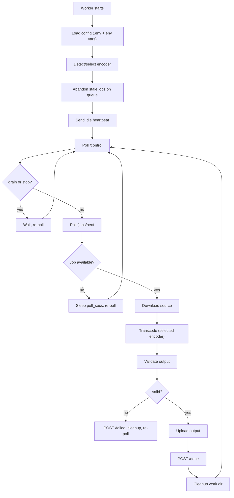
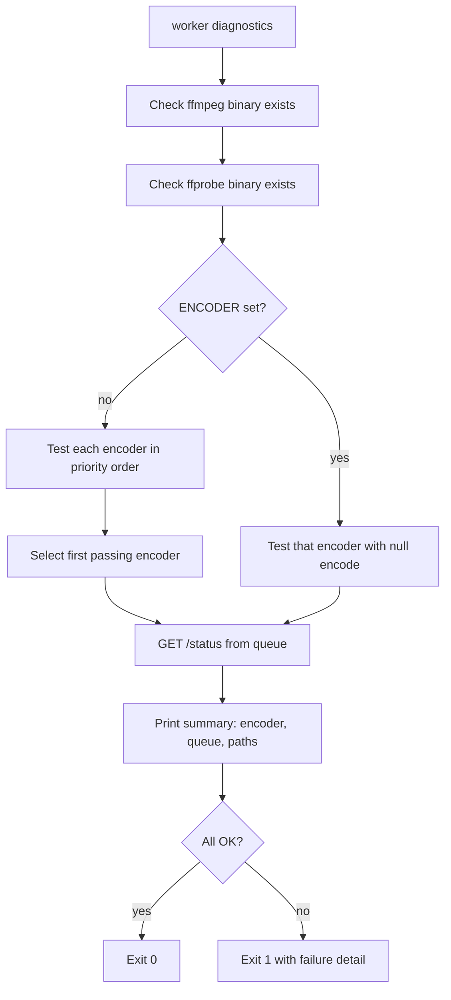
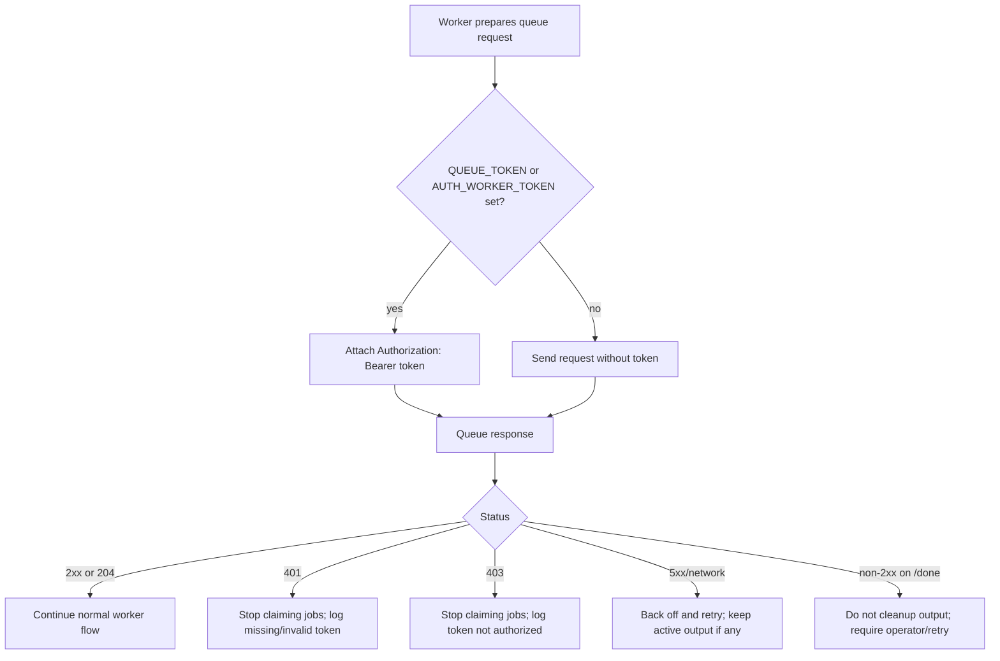

---
tags:
  - prd
  - workers
  - linux
  - windows
  - qsv
  - vaapi
  - nvenc
  - release
created: 2026-06-10
last_updated: 2026-06-10
last_audited: 2026-06-10
---

# PRD: Missing Workers

## Agent Handoff Summary

Finish verification and release hardening for Enkodu worker nodes.

Current status after 2026-06-10 worker gap-fill:

- Windows worker (`yulia-worker.exe`): functional encode loop, heartbeat, progress reporting, control commands, `worker.env`, diagnostics, `--version`, Scheduled Task installer/update script, bearer-token auth, and actionable auth halt behavior are present.
- Worker bearer-token support is present: requests can send `Authorization: Bearer ...` from `QUEUE_TOKEN` or `AUTH_WORKER_TOKEN`.
- Queue has opt-in strict auth, `/healthz`, and `/version`; worker diagnostics checks these where available.
- Linux worker: implementation exists in the same Rust binary with Linux defaults, `~/.config/yulia-worker/worker.env`, user systemd installer, and encoder probing for QSV, VAAPI, NVENC, and SVT-AV1. It still needs real Linux host diagnostics and fixture transcode evidence.
- macOS worker: deferred. AV1 hardware encode is not broadly available on macOS hardware, and software encode is too slow for the product goal.
- Android/iOS worker: out of scope. Mobile devices submit to the queue; they do not transcode.

Important boundary:

- This PRD is for worker nodes (machines that transcode video).
- It is not for companion clients (the macOS/Linux/Windows/mobile apps that submit files and download results).
- Companion client work is tracked in [[Missing Companion Clients PRD]].

## Product Problem

One Windows worker limits total throughput to one job at a time on one machine. Additional capacity requires either adding more Windows QSV machines or making the worker run on Linux, where most server and homelab hardware lives. The current worker binary is also hard to install, update, diagnose, or configure without editing source code.

| Platform | Worker Status | This PRD |
|---|---:|---|
| Windows | Partial — implementation present, needs real-host fixture evidence | Verify installer, config, diagnostics, strict auth, and fixture transcode |
| Linux | Partial — implementation and installer present, needs real-host evidence | Verify encoder detection, systemd install, strict auth, and fixture transcode |
| macOS | Out of scope | AV1 hardware encode not broadly available |
| Android | Out of scope | Too slow/impractical for durable background transcoding |
| iOS | Out of scope | Too slow/impractical for durable background transcoding |

## Goals

- Verify and harden the existing Windows worker operability work (installer, config file, update path, dependency docs, health diagnostics).
- Verify the Linux worker implementation on real Linux hosts with hardware encoder detection and software SVT-AV1 fallback.
- Keep the worker stateless: all job state stays in the queue service.
- Work against authenticated queue deployments with `AUTH_WORKER_TOKEN` and `AUTH_LEGACY_MACHINE_ACCESS=false`.
- Keep the validation contract identical across all platforms: codec must be av1, duration must match within 2 seconds.
- Produce install and operate documentation for each platform.
- Never touch source files; all outputs are `_av1`-suffixed alongside the original.

## Non-Goals

- Building a macOS worker. VideoToolbox AV1 encode is not available on most Macs; software encode is too slow for the product goal. Revisit only if target hardware changes.
- Building mobile workers.
- Reworking the queue service.
- Multi-job parallelism per worker node (one job at a time per worker remains the contract).
- Automatic source file deletion or replacement.
- GPU cluster scheduling or distributed file systems.

## Users

### Primary User: Operator

Adds, configures, monitors, and removes worker nodes.

Needs:

- A single-file binary or simple install script.
- Config via environment file or config file (not source code).
- `worker diagnostics` command to confirm ffmpeg, hardware encoder, and queue connectivity.
- Clear logs under a predictable path.
- A service unit (systemd on Linux, Scheduled Task on Windows) that restarts on failure.
- An update path that doesn't break running jobs.

### Secondary User: Queue Dispatcher

The queue assigns jobs to registered workers. It tracks heartbeat, drain/stop commands, progress, and job outcomes.

Needs:

- Worker to identify itself with a stable name.
- Worker to report heartbeat, current job, and status reliably.
- Worker to abandon stale jobs on startup.
- Worker to upload verified output before posting `done`.

## Current Windows Worker State

### What Works

- Polls `/jobs/next?worker=<name>`, claims one job at a time.
- Downloads source via `GET /jobs/{id}/source`.
- Transcodes with `av1_qsv` via ffmpeg (`-c:v av1_qsv -global_quality 28 -preset medium`).
- Streams ffmpeg progress to `POST /jobs/{id}/progress` every 2 seconds.
- Validates output: codec must be `av1`, duration must be within 2 seconds of source.
- Uploads output via `PUT /jobs/{id}/output`.
- Reports `done` or `failed` with error detail.
- Sends heartbeat every 30 seconds (`POST /workers/{name}/heartbeat`).
- Respects `drain` and `stop` from `GET /control`.
- Kills in-flight ffmpeg when `stop` is received.
- Cleans up stale jobs on startup via `POST /jobs/abandon?worker=<name>`.
- Logs to `C:\transcode\logs\worker.log`.
- Runs as a Windows Scheduled Task.
- Reads `C:\transcode\worker.env` plus environment overrides.
- Sends bearer auth from `QUEUE_TOKEN` or `AUTH_WORKER_TOKEN`.
- Provides `yulia-worker.exe --version` and `yulia-worker.exe diagnostics`.
- Detects AV1 encoders when `ENCODER` is unset and supports QSV, VAAPI, NVENC, and SVT-AV1 profiles.
- Checks state-changing HTTP responses; if `/done` is rejected, local output is retained for operator recovery.
- Exits with code `2` after repeated critical auth rejection so the operator can fix config and restart.
- Rotates `worker.log` when it exceeds 50 MiB.

### What Is Missing

- No real Windows strict-auth fixture has been captured yet.
- No real Windows fixture transcode run has been captured yet.
- No real Linux diagnostics or fixture transcode run has been captured yet.
- No automated dependency bootstrap for ffmpeg/ffprobe; docs still rely on msys2 on Windows and distro packages on Linux.
- No dashboard/service-manager UI for workers.
- No graceful-shutdown on `drain` while job is in progress (currently waits for job to finish, which is correct, but is not documented or tested).
- Stop semantics are unclear: killing ffmpeg causes the current implementation to abandon/requeue rather than mark failed, but this is not documented or tested.
- Worker test coverage exists, but strict-auth/diagnostics behavior still needs integration evidence.

## Remaining Windows Work

### P0: Must Fix Before Calling Windows Worker Done

- [x] Add `.env` file loader — read `C:\transcode\worker.env` (or `WORKER_ENV_FILE` env var) on startup; environment variables override file values.
- [x] Make strict queue auth first-class.
  - Read `QUEUE_TOKEN` first, `AUTH_WORKER_TOKEN` as compatibility alias.
  - Send bearer token on every queue API request.
  - Never log the raw token.
  - Treat `401` as missing/invalid token and `403` as token not authorized.
  - Fixture run with queue `AUTH_ENABLED=true`, `AUTH_WORKER_TOKEN` set, and `AUTH_LEGACY_MACHINE_ACCESS=false` is still pending.
- [x] Check HTTP status for critical state-changing requests.
  - `POST /done` must require 2xx before local cleanup and "complete" logging.
  - `POST /failed` should log if the queue rejects the failure report.
  - `POST /progress` and `/jobs/abandon` can remain best-effort but should log repeated auth/server failures.
  - `POST /workers/{name}/heartbeat` returning `401` or `403` must trigger the same halt-and-alert behavior as a job-claim `401`: stop claiming new jobs and surface a clear operator error. A heartbeat auth failure means the queue cannot track this worker and will eventually consider it lost.
- [x] URL-encode or sanitize `WORKER_NAME` everywhere it appears in a query string or path segment.
- [x] Add `worker diagnostics` subcommand:
  - Check ffmpeg binary exists and runs.
  - Check ffprobe binary exists and runs.
  - Run a one-second null encode to confirm the selected encoder (e.g. `av1_qsv`) is available.
  - `GET /healthz`, `GET /version`, and `GET /status` from queue where available.
  - Confirm worker token is accepted when queue auth is enabled.
  - Print worker name, queue URL, work dir, and log path.
  - Print token state as `unset` or `set`, never the token value.
  - Exit 0 if all pass, non-zero if any fail.
- [x] Add `--version` flag that prints `yulia-worker X.Y.Z`.
- [x] Write a PowerShell install/update script:
  - Downloads latest `yulia-worker.exe`.
  - Places binary at `C:\transcode\yulia-worker.exe`.
  - Creates or updates the Scheduled Task.
  - Does not restart a running job.
- [x] Document ffmpeg/ffprobe dependency bootstrap (msys2 pacman command).
- [x] Add basic tests:
  - Config loading from `.env` file.
  - Encoder detection stub.
  - Validation logic for codec and duration.

### P1: Strongly Recommended

- [ ] Parameterize the quality/preset: read `ENCODE_QUALITY` (default `28`) and `ENCODE_PRESET` (default `medium`) from config.
- [ ] Parameterize the audio codec: read `AUDIO_CODEC` (default `aac`) and `AUDIO_BITRATE` (default `192k`).
- [ ] Confirm graceful-drain behavior under test: drain while job is active should finish the current job, then stop polling.
- [ ] Decide and document stop behavior:
  - Option A: stop kills current encode and requeues/abandons the job.
  - Option B: stop kills current encode and marks the job failed.
  - Current behavior appears closest to Option A; make it explicit and test it.
- [ ] Reduce log noise: `[timestamp] Idle` every 10 seconds is noisy; log idle only every N minutes or on state change.
- [ ] Verify coexistence with `enkodu.exe` companion on the same machine.
- [ ] Add exponential backoff for repeated queue poll/connect/auth failures instead of fixed tight polling.

## Linux Worker Requirements

### Target

- x86_64 Linux first.
- ARM64 Linux stretch goal (for homelab/NAS hardware).

### Encoder Priority

The Linux worker should detect available hardware encoders at startup and select the best available encoder in this order:

| Priority | Encoder | Flag | Requirement |
|---:|---|---|---|
| 1 | Intel QSV | `av1_qsv` | Intel GPU with VA-API + iHD driver |
| 2 | NVIDIA NVENC | `av1_nvenc` | NVIDIA RTX 4000 series or later (AV1 NVENC requires Lovelace) |
| 3 | AMD/Intel VAAPI | `av1_vaapi` | Mesa + VA-API capable GPU |
| 4 | Software SVT-AV1 | `libsvtav1` | No GPU required; slow but universal |

Detection approach:

1. Run `ffmpeg -hide_banner -encoders 2>/dev/null | grep av1` to list available encoders.
2. For hardware encoders, attempt a one-second null encode using a tiny test file and the candidate encoder.
3. Record which encoder succeeds and log the selection.
4. If `ENCODER` env var is set, use that encoder unconditionally (skip detection).

SVT-AV1 quality settings differ from QSV (`-crf` and `-preset` instead of `-global_quality` and `-preset`). See Encoder Profiles below.

### Required

- Binary named `yulia-worker` (no `.exe`).
- Config via environment variables or `$HOME/.config/yulia-worker/worker.env` (or `WORKER_ENV_FILE`).
- Authenticated queue support via `QUEUE_TOKEN` or `AUTH_WORKER_TOKEN`.
- Startup encoder detection with logged result.
- `worker diagnostics` subcommand matching Windows spec.
- `--version` flag.
- Validation contract identical to Windows: codec = av1, duration within 2 seconds.
- Log to `$HOME/.local/share/yulia-worker/logs/worker.log` (or `LOG_DIR` env var).
- Work directory: `/tmp/yulia-worker/jobs` (or `WORK_DIR` env var).
- systemd user unit: `~/.config/systemd/user/yulia-worker.service` (or system unit `/etc/systemd/system/yulia-worker.service`).
- Install script: `install-linux.sh` that places binary, writes systemd unit, and runs `systemctl --user enable --now yulia-worker`.
- Uninstall script or documented uninstall steps.
- Dependency check for ffmpeg/ffprobe at startup (log error and exit if missing).
- User/group permission guidance for `/dev/dri/renderD*` and NVIDIA device nodes.
- SELinux/AppArmor/container notes if the worker is run inside a service or container.

### Acceptance Criteria (Linux)

- [ ] Fresh Linux machine can follow `LINUX.md` docs to reach a running worker.
- [ ] `yulia-worker diagnostics` reports encoder selection, ffmpeg/ffprobe OK, queue reachable.
- [ ] `yulia-worker diagnostics` reports token acceptance when queue auth is enabled.
- [ ] Worker processes a fixture job end-to-end (submit via companion or queue API → encode → upload → done).
- [ ] Validated output codec is `av1` and duration is within 2 seconds.
- [ ] Worker restarts after reboot via systemd.
- [ ] Worker restarts on failure via systemd `Restart=on-failure`.
- [ ] Drain/stop control commands work.
- [ ] Work directory is cleaned up after successful job.
- [ ] Work directory is retained or quarantined when `/done` is rejected, so the output is not lost.

## Encoder Profiles

### QSV (Intel, Windows and Linux)

```
ffmpeg -i input.mp4
  -c:v av1_qsv
  -global_quality <ENCODE_QUALITY, default 28>
  -preset <ENCODE_PRESET, default medium>
  -c:a <AUDIO_CODEC, default aac> -b:a <AUDIO_BITRATE, default 192k>
  -movflags +faststart
  -progress pipe:1 -stats_period 2 -loglevel error
  output_av1.mp4 -y
```

### NVENC (NVIDIA, Linux)

```
ffmpeg -i input.mp4
  -c:v av1_nvenc
  -cq <ENCODE_QUALITY, default 28>
  -preset <ENCODE_PRESET, default p4>
  -c:a <AUDIO_CODEC, default aac> -b:a <AUDIO_BITRATE, default 192k>
  -movflags +faststart
  -progress pipe:1 -stats_period 2 -loglevel error
  output_av1.mp4 -y
```

### VAAPI (AMD/Intel, Linux)

```
ffmpeg -vaapi_device /dev/dri/renderD128
  -i input.mp4
  -vf 'format=nv12,hwupload'
  -c:v av1_vaapi
  -qp <ENCODE_QUALITY, default 28>
  -c:a <AUDIO_CODEC, default aac> -b:a <AUDIO_BITRATE, default 192k>
  -movflags +faststart
  -progress pipe:1 -stats_period 2 -loglevel error
  output_av1.mp4 -y
```

Note: VAAPI device path may differ (`/dev/dri/renderD128` is the most common default). If `VAAPI_DEVICE` env var is set, use that path.

### SVT-AV1 Software (all platforms, fallback)

```
ffmpeg -i input.mp4
  -c:v libsvtav1
  -crf <ENCODE_QUALITY, default 28>
  -preset <ENCODE_PRESET, default 6>
  -c:a <AUDIO_CODEC, default aac> -b:a <AUDIO_BITRATE, default 192k>
  -movflags +faststart
  -progress pipe:1 -stats_period 2 -loglevel error
  output_av1.mp4 -y
```

Note: SVT-AV1 `-preset` scale is 0–12 (lower = slower/better). Default 6 is balanced. This is separate from QSV/NVENC preset semantics.

## Proposed Architecture

### Shared Core vs Platform Differences

The Windows and Linux workers share nearly all logic. The only platform differences are:

| Concern | Windows | Linux |
|---|---|---|
| Default ffmpeg path | `C:\msys64\mingw64\bin\ffmpeg.exe` | `ffmpeg` (from PATH) |
| Default ffprobe path | `C:\msys64\mingw64\bin\ffprobe.exe` | `ffprobe` (from PATH) |
| Default work dir | `C:\transcode\jobs` | `/tmp/yulia-worker/jobs` |
| Default log dir | `C:\transcode\logs` | `~/.local/share/yulia-worker/logs` |
| Default config file | `C:\transcode\worker.env` | `~/.config/yulia-worker/worker.env` |
| Service unit | Scheduled Task | systemd user/system unit |
| Encoder default | `av1_qsv` | detected |
| VAAPI device | N/A | `/dev/dri/renderD128` |

The Cargo workspace can produce both binaries from the same source with platform defaults controlled by `#[cfg(target_os)]`. Alternatively, a single source tree with runtime platform detection is acceptable.

### Module Layout (Proposed)

```
worker/src/
  main.rs          ← entry point: config, thread setup, main loop
  config.rs        ← Config struct, .env file loader, platform defaults
  encoder.rs       ← encoder detection, profile selection, ffmpeg invocation
  validate.rs      ← ffprobe-based codec and duration validation
  api.rs           ← HTTP client: poll, download, upload, progress, heartbeat
  diagnostics.rs   ← `worker diagnostics` subcommand
  log.rs           ← structured logging to file + stderr
```

### Worker Flow



### Diagnostics Flow



### Worker Auth Failure Flow



## API Requirements

The worker uses the same queue API surface that already exists. No new queue endpoints are required for the Linux worker.

Endpoints used:

| Endpoint | Purpose |
|---|---|
| `GET /healthz` | Diagnostics: basic queue health |
| `GET /version` | Diagnostics: queue version/build where available |
| `GET /jobs/next?worker=<name>` | Claim next available job |
| `GET /jobs/{id}/source` | Download source file |
| `POST /jobs/{id}/progress` | Stream encode progress |
| `PUT /jobs/{id}/output` | Upload completed output |
| `POST /jobs/{id}/done` | Mark job done |
| `POST /jobs/{id}/failed` | Mark job failed with error |
| `POST /workers/{name}/heartbeat` | Report worker status |
| `POST /jobs/abandon?worker=<name>` | Release stale jobs on startup |
| `GET /control` | Poll for drain/stop commands |
| `GET /status` | Used by diagnostics command only |

Nice-to-have additions (not required for this PRD):

- `POST /workers/{name}/register` — formal worker registration with platform and encoder metadata.

Auth:

- When `AUTH_ENABLED=true` and `AUTH_WORKER_TOKEN` is set on the queue, every worker request must include `Authorization: Bearer <QUEUE_TOKEN>`.
- The worker should read `QUEUE_TOKEN` first and `AUTH_WORKER_TOKEN` as a compatibility alias.
- Diagnostics must distinguish:
  - `401`: missing or invalid worker token.
  - `403`: token accepted but not authorized for the attempted endpoint.
  - network failure: queue unreachable.
  - `404` on `/healthz` or `/version`: older queue; fall back to `/status`.

## Safety Requirements

Identical to the Windows worker:

- Output must not be written back to the NAS/queue until validation passes.
- Validation must confirm codec = `av1` and duration within 2 seconds of source.
- If validation fails, `POST /failed` with error detail. Do not `POST /done`.
- If upload fails, do not `POST /done`.
- If `POST /done` is rejected or times out, do not delete the local output. Keep it for retry or quarantine and surface a clear operator error.
- If auth fails with `401` or `403`, stop claiming new jobs and surface a clear operator error at ERROR log level. Do not keep a busy loop of failing requests.
  - **Exit behavior**: exit with a non-zero code (e.g. exit 2) after logging the auth failure. `systemd Restart=on-failure` will restart the worker — to prevent an immediate restart loop on a permanently bad token, the worker should sleep at least 30 seconds before exiting, or the unit file should set `RestartSec=30`.
  - **Recovery**: the worker does not re-read config or retry auth automatically while running. Fix the token in `worker.env` (or the environment) and restart the service.
- State-changing queue calls must check for 2xx responses before assuming success.
- Worker tokens must never appear in logs, diagnostics output, telemetry, panic messages, or command-line arguments.
- Work directory is cleaned up only after successful done report.
- Failed job work directory is cleaned up after failed report (do not accumulate disk).
- Worker never touches the source file path on the NAS; it downloads a copy and works locally.
- Original files are never modified by the worker.

## Config Reference

All config is readable from environment variables. If a `.env` file path is found, it is loaded first; environment variables override file values.

| Variable | Default (Windows) | Default (Linux) | Description |
|---|---|---|---|
| `QUEUE_URL` | `http://172.16.81.137:8090` | same | Queue service base URL |
| `QUEUE_TOKEN` | empty | empty | Bearer token sent to authenticated worker endpoints |
| `AUTH_WORKER_TOKEN` | empty | empty | Compatibility alias for `QUEUE_TOKEN`; useful when sharing queue env naming |
| `WORKER_NAME` | `%COMPUTERNAME%` | `$HOSTNAME` | Worker identifier sent to queue |
| `FFMPEG_PATH` | `C:\msys64\mingw64\bin\ffmpeg.exe` | `ffmpeg` | Path to ffmpeg binary |
| `FFPROBE_PATH` | `C:\msys64\mingw64\bin\ffprobe.exe` | `ffprobe` | Path to ffprobe binary |
| `WORK_DIR` | `C:\transcode\jobs` | `/tmp/yulia-worker/jobs` | Directory for per-job working files |
| `LOG_DIR` | `C:\transcode\logs` | `~/.local/share/yulia-worker/logs` | Log output directory |
| `WORKER_ENV_FILE` | `C:\transcode\worker.env` | `~/.config/yulia-worker/worker.env` | Path to optional `.env` config file |
| `POLL_SECS` | `10` | `10` | Seconds between job polls when idle |
| `ENCODER` | (auto-detected) | (auto-detected) | Override encoder: `av1_qsv`, `av1_nvenc`, `av1_vaapi`, `libsvtav1` |
| `ENCODE_QUALITY` | `28` | `28` | Quality value passed to encoder (`-global_quality`, `-cq`, `-qp`, or `-crf` depending on encoder) |
| `ENCODE_PRESET` | `medium` | `medium` (QSV/NVENC), `6` (SVT-AV1) | Encoder preset |
| `AUDIO_CODEC` | `aac` | `aac` | Audio codec |
| `AUDIO_BITRATE` | `192k` | `192k` | Audio bitrate |
| `VAAPI_DEVICE` | N/A | `/dev/dri/renderD128` | VAAPI render node path (Linux only) |

Config file requirements:

- `.env` file values load first; process environment overrides them.
- `QUEUE_TOKEN` and `AUTH_WORKER_TOKEN` must be redacted in diagnostics and logs.
- Install scripts should create config files with restrictive permissions:
  - Windows: readable by the service account/operator only where practical.
  - Linux: `0600` for `worker.env`. If the worker finds `worker.env` with permissions more permissive than `0600` (e.g. world-readable `0644`), it must log a warning at startup: "worker.env permissions are too open (expected 0600); token may be exposed to other users." The worker may proceed but must not silently ignore the risk.
- `WORKER_NAME` must be URL-safe after encoding/sanitization; raw names may still appear in human-readable logs.

## Implementation Plan For Vibe Agent

### Phase 0: Windows Operability Gap-Fill

Deliverables:

- `.env` file loader in `config.rs`.
- Strict-auth hardening:
  - `QUEUE_TOKEN` / `AUTH_WORKER_TOKEN` in config.
  - Bearer token on every worker request.
  - Clear handling for `401` and `403`.
  - Redaction in diagnostics/logs.
- HTTP status hardening for queue writes, especially `/done`.
- URL-safe worker name handling in query/path construction.
- `worker diagnostics` subcommand.
- `--version` flag.
- PowerShell install/update script.
- ffmpeg/ffprobe dependency check on startup with friendly error.
- Basic unit tests (config loading, validation logic).

Acceptance:

- `yulia-worker.exe --version` prints version.
- `yulia-worker.exe diagnostics` succeeds on a machine with ffmpeg and queue reachable, fails with clear output on misconfigured machine.
- `yulia-worker.exe diagnostics` succeeds against an authenticated queue when `QUEUE_TOKEN` is correct and fails clearly when it is missing or wrong.
- Worker does not delete local output when `/done` returns non-2xx.
- `install-windows.ps1` creates or updates the Scheduled Task without interrupting a running job.
- `cargo check` passes on all Windows targets.
- New unit tests pass.

### Phase 1: Linux Worker — Hardware Detection and QSV/VAAPI

Deliverables:

- Cross-compile or native Linux build of `yulia-worker`.
- Reuse Phase 0 strict-auth, diagnostics, status-checking, and redaction behavior.
- Encoder detection at startup (QSV → VAAPI → software fallback).
- Linux platform defaults for paths.
- `LINUX.md` install documentation.
- `install-linux.sh` script (binary, systemd unit, enable + start).
- `worker diagnostics` subcommand working on Linux.

Acceptance:

- `cargo build --target x86_64-unknown-linux-gnu --release` succeeds.
- `yulia-worker diagnostics` reports encoder, ffmpeg/ffprobe status, queue connectivity.
- Strict-auth fixture passes on Linux with `AUTH_LEGACY_MACHINE_ACCESS=false`.
- Worker processes a fixture job end-to-end on Linux.
- systemd unit restarts worker after reboot.
- Worker drain/stop commands work.

### Phase 2: Linux Worker — NVENC and SVT-AV1 Fallback

Deliverables:

- NVENC encoder profile and detection.
- SVT-AV1 software encoder profile and detection.
- Quality/preset parameterisation consistent across all encoder profiles.
- VAAPI device path configurable.
- Document each encoder's system requirements and tested driver versions.

Acceptance:

- On a machine with NVIDIA AV1-capable GPU, worker selects `av1_nvenc`.
- On a machine with no GPU, worker selects `libsvtav1`.
- `ENCODER=libsvtav1` env var forces software encode.
- Fixture job passes validation on each encoder profile.

### Phase 3: Hardening and Distribution

Deliverables:

- Structured logging (timestamp, level, worker name, job id).
- Log rotation or size cap (do not fill disk).
- Windows installer verifies ffmpeg/ffprobe presence and prints download instructions if missing.
- Release build for both Windows and Linux packaged as GitHub Release artifacts.
- Checksums for distributed binaries.
- `CHANGELOG.md` entry.

Acceptance:

- Both binaries in a GitHub Release.
- Install docs reference the release URL.
- `yulia-worker --version` reports the released version.

## Testing Requirements

### Unit Tests

- Config loading from `.env` file (file values loaded, env vars override).
- Platform default path selection per OS.
- Token config precedence: `QUEUE_TOKEN` wins, `AUTH_WORKER_TOKEN` is fallback, both are redacted.
- HTTP write handling: non-2xx `/done` returns an error and blocks cleanup.
- URL encoding/sanitization for worker name in query/path URLs.
- Validation logic: codec mismatch, duration mismatch, missing output file.
- Encoder detection stub: verify priority order is respected.
- Diagnostics output format: confirm all required fields are present.
- Diagnostics auth cases: no token, bad token, good token, forbidden token.

### Manual Fixture Test (per platform)

1. Start queue service.
2. Install worker with install script.
3. Run `worker diagnostics` — confirm all OK.
4. Submit a small test video via companion or queue API.
5. Observe worker claim job, transcode, validate, upload.
6. Confirm queue shows `done` with `verify_status = pass`.
7. Confirm output is `_av1`-suffixed and passes local ffprobe check.
8. Reboot machine — confirm worker restarts and picks up idle state.
9. Submit job, issue drain via `/control` — confirm worker finishes current job and stops polling.
10. Repeat with `AUTH_ENABLED=true`, `AUTH_WORKER_TOKEN` set, and `AUTH_LEGACY_MACHINE_ACCESS=false`.
11. Repeat with a bad worker token — confirm diagnostics/main loop fail clearly and no new job is claimed.

### Edge Cases

- Job claimed but source download fails → `failed` reported, work dir cleaned.
- Encode completes but validation fails → `failed` reported, bad output removed.
- Encode completes but upload fails → `failed` reported (not `done`).
- Upload succeeds but `/done` fails or returns `401`/`403`/`500` → local output is retained and the worker reports an actionable error.
- Worker restarts mid-job → stale job abandoned on startup, available for re-claim.
- Stop command during encode → behavior matches documented policy: requeue/abandon or fail, but never lose the job silently.
- Disk full during encode → ffmpeg exits non-zero → `failed` reported with error detail.

## Documentation Deliverables

New files:

- `worker/docs/WINDOWS.md` — install, configure, update, diagnostics, uninstall on Windows.
- `worker/docs/LINUX.md` — install, configure, update, diagnostics, uninstall on Linux; list tested distros and driver requirements per encoder.
- `worker/install-windows.ps1` — automated install/update script.
- `worker/install-linux.sh` — automated install/update script.
- Worker auth section in both platform docs:
  - How to set `AUTH_WORKER_TOKEN` on the queue.
  - How to set `QUEUE_TOKEN` on the worker.
  - How to test with `AUTH_LEGACY_MACHINE_ACCESS=false`.
  - How to rotate the token without losing active jobs. The worker reads `QUEUE_TOKEN` only at startup; a change in `worker.env` does not take effect until the process is restarted. Safe rotation procedure: (1) update the token in `worker.env`; (2) wait for the current job to finish or drain via `/control`; (3) restart the worker service.

Update:

- `docs/obsidian-vault/03-Platforms/Platform Matrix.md` — mark worker status after each phase.
- `docs/obsidian-vault/04-Operations/Runbook.md` — add worker add/remove/update procedures.
- `docs/obsidian-vault/05-Product/Roadmap.md` — mark worker milestones as they complete.

## Definition of Done

Windows worker is done when:

- `.env` file config is supported.
- Strict worker-token auth is supported and verified.
- `worker diagnostics` command works and covers ffmpeg, encoder, and queue.
- Diagnostics distinguishes unreachable queue, missing/bad token, forbidden token, and missing ffmpeg/ffprobe.
- `--version` flag works.
- Queue write responses are checked; the worker does not delete local output after a rejected `/done`.
- Install script creates or updates Scheduled Task.
- Docs explain install, configure, update, and diagnose steps.
- At least one fixture flow has been manually verified.

Linux worker is done when:

- Worker binary builds for `x86_64-unknown-linux-gnu`.
- Encoder detection selects QSV, VAAPI, NVENC, or SVT-AV1 based on availability.
- Strict worker-token auth works on Linux.
- systemd unit restarts the worker on reboot and failure.
- `worker diagnostics` reports encoder selection and queue connectivity.
- Queue write responses are checked; the worker does not delete local output after a rejected `/done`.
- At least one fixture flow has been manually verified on a real Linux machine.
- Docs explain install, configure, and operate steps including encoder-specific system requirements.

## Vibe CLI Prompt: Windows Operability Gap-Fill

```text
You are working in /Users/manwe/CascadeProjects/YuliaAV1.

Read AGENTS.md and docs/obsidian-vault/05-Product/Missing Workers PRD.md first.

Goal: fill the operability gaps in the Windows worker (worker/src/main.rs).

Do NOT build the Linux worker yet. Do NOT work on companion clients.
Do NOT copy secrets from ~/.agentSecrets into the repo.

Deliverables:
- Add .env file loader to config.rs (or inline in config loading): read WORKER_ENV_FILE path (default C:\transcode\worker.env on Windows), parse KEY=VALUE pairs, apply before environment variables.
- Harden queue auth: read QUEUE_TOKEN first and AUTH_WORKER_TOKEN as fallback, send bearer auth on every worker request, redact token in logs/diagnostics.
- Make auth failures actionable: distinguish 401 missing/bad token, 403 forbidden token, queue unreachable, and older server without health/version endpoints.
- Check HTTP status for all state-changing queue writes. POST /done must require 2xx before logging complete or deleting local output.
- URL-encode or sanitize WORKER_NAME in query strings and path segments.
- Add `worker diagnostics` subcommand: check ffmpeg/ffprobe exist, run a one-second null encode to confirm the selected encoder, GET /status, print summary, exit 0/1.
- Diagnostics should also try /healthz and /version when available and confirm token acceptance when auth is enabled.
- Add `--version` flag that prints the version from Cargo.toml.
- Add startup check: if ffmpeg/ffprobe binary is missing, print a friendly error and exit 1 rather than crashing later.
- Parameterize ENCODE_QUALITY, ENCODE_PRESET, AUDIO_CODEC, AUDIO_BITRATE from config.
- Add basic unit tests for config loading, validation logic (codec mismatch, duration mismatch).
- Add tests for token precedence/redaction, non-2xx /done handling, URL-safe worker names, and diagnostics auth failure cases.
- Write worker/install-windows.ps1: download binary, place at C:\transcode\yulia-worker.exe, create/update Scheduled Task.
- Write worker/docs/WINDOWS.md: install, configure, update, diagnose steps.

Quality bar:
- cargo check passes on Windows targets (x86_64-pc-windows-gnu, x86_64-pc-windows-msvc).
- cargo test passes.
- No new hardcoded paths; all paths come from config.
- Strict-auth fixture passes with AUTH_ENABLED=true, AUTH_WORKER_TOKEN set, and AUTH_LEGACY_MACHINE_ACCESS=false.
```

## Vibe CLI Prompt: Linux Worker

```text
You are working in /Users/manwe/CascadeProjects/YuliaAV1.

Read AGENTS.md and docs/obsidian-vault/05-Product/Missing Workers PRD.md first.

Goal: build a Linux worker (yulia-worker) that detects available hardware AV1 encoders and falls back to software SVT-AV1.

Do NOT work on companion clients. Do NOT copy secrets from ~/.agentSecrets into the repo.

Start from worker/src/main.rs. The Windows worker is the reference implementation. Reuse as much as possible.

Deliverables:
- Preserve Windows worker auth/status hardening: QUEUE_TOKEN support, redaction, non-2xx write handling, URL-safe worker names.
- Add encoder detection at startup: try av1_qsv → av1_vaapi → av1_nvenc → libsvtav1 in that order. Run a one-second null encode probe to confirm each. Respect ENCODER env var override.
- Add encoder-specific ffmpeg profiles (see PRD Encoder Profiles section). QSV uses -global_quality, VAAPI uses -qp + hwupload filter, NVENC uses -cq, SVT-AV1 uses -crf and preset 0-12.
- Platform defaults for Linux: work dir /tmp/yulia-worker/jobs, log dir ~/.local/share/yulia-worker/logs, config file ~/.config/yulia-worker/worker.env.
- VAAPI_DEVICE config var (default /dev/dri/renderD128).
- `worker diagnostics` subcommand (same as Windows spec).
- --version flag.
- Write worker/docs/LINUX.md: install, configure, update, diagnose steps including driver requirements per encoder.
- Write worker/install-linux.sh: place binary, write systemd user unit, systemctl enable --now.

Quality bar:
- cargo build --target x86_64-unknown-linux-gnu --release succeeds (cross-compile from macOS acceptable; native build preferred for CI).
- Validation contract is unchanged: codec = av1, duration within 2 seconds.
- No Windows paths in Linux defaults.
- Strict-auth fixture passes on Linux with AUTH_LEGACY_MACHINE_ACCESS=false.
```
