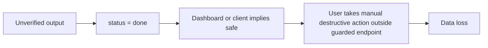

---
tags:
  - risks
  - release
---

# Risk Register

| Risk | Severity | Current Signal | Mitigation |
|---|---:|---|---|
| `done` can mean uploaded-but-not-verified | P0 | Queue sets `status='done'` before async verification completes | Add `verifying` status or require `verify_status=pass` everywhere |
| Users can still misread `done` as safe in UI/reporting | P0 | Output/download/delete endpoints are guarded, but the status name remains overloaded | Dashboard/client banners and labels must require `verify_status=pass` |
| End-to-end smoke fixture exists but has not been run with a real worker in this vault update | P0 | `queue/test_e2e.py` exists; release evidence still needed | Run tiny fixture through queue + worker + download + checksum |
| Strict machine-token mode lacks deployment dry-run evidence | P1 | Worker/companion token plumbing exists; `AUTH_LEGACY_MACHINE_ACCESS=false` fixture pending | Run strict-auth deployment dry run and record results |
| Resumable upload sessions are process-memory state | P1 | `_resumable_uploads` is in memory; partial bytes are on disk | Make sessions durable or document restart recovery as fresh-session restart |
| Mobile scaffolds can look more complete than they are | P1 | Android/iOS transfer/auth code exists but lacks real-device release evidence | Keep mobile behind explicit beta gate until auth, background transfer, and save/share pass on devices |
| Worker platform expansion needs real encoder evidence | P1 | Encoder probing exists; Linux/Windows fixture runs still needed | Capture diagnostics and fixture encode logs per target host/encoder |
| macOS companion is unsigned | P1 | Install page removes quarantine | Accept only for trusted release or add signing/notarization |
| Docs drift from code | P1 | `AGENTS.md`, `CLAUDE.md`, and PRD describe older behavior | Update root docs after vault review |
| Dashboard embedded in Python string | P2 | Large inline HTML/JS in `queue/main.py` | Split when UI changes become frequent |
| Companion `replace` mode can rename originals | P2 | Config supports replace | Hide or loudly mark as advanced for limited release |
| In-memory worker/live state lost on restart | P2 | `_workers` and `_live` are process memory | Accept for now; durable progress later if needed |

## Highest-Risk Release Path

The guarded API breaks automatic delete/download/checksum paths. Break the remaining path at B/C with UI wording and operational docs before release.
